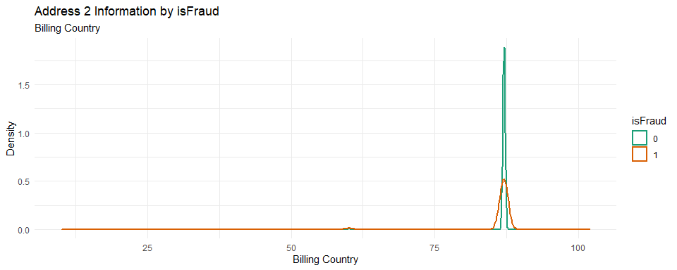
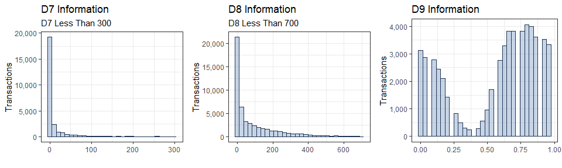
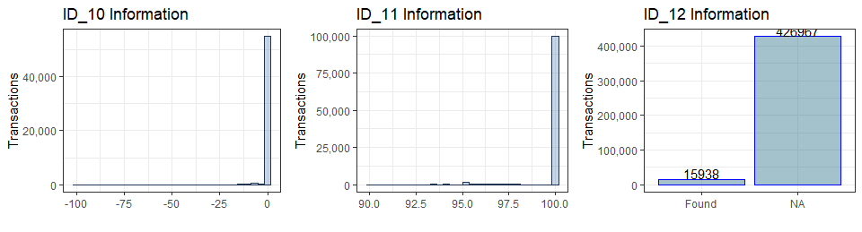

Fraud Detection from Customer Transaction
================
Seyoung Jung
08/03/2020

-----

# 1 Introduction

Today, due to the development of digital payments, less people are
carrying cash. According to this news article titled [More Americans say
they don’t carry
cash](https://www.cnbc.com/2019/01/15/more-americans-say-they-dont-carry-cash.html),
“in an average week, roughly 3 in 10 adults said they make zero
purchases using cash”. Also it mentions that “millennials are paving the
way among people ditching bills and coins in favor or credit, debit and
digital payments, through apps like Apple Pay, Venmo, and Zelle.”
Digital payments are very convenient; you don’t have to carry your fat
wallet anymore, and most importantly, it allows you to shop online.
Especially during this ongoing global pandemic of COVID-19, the online
consumer market is growing exponentially to avoid physical contact with
others.

However, this digital payment system has a serious problem; exposure to
fraud transactions. And this
[article](https://www.paymentssource.com/opinion/coronavirus-increases-exposure-for-digital-payments-fraud)
suggests that “coronavirus increases exposure for digital payments
fraud.” So, many experts are trying to develop
methods to decrease the number of fraud transactions.

In this project, we build models that predict whether a transaction is a
fraud. The dataset used for this project can be found
[here](https://www.kaggle.com/c/ieee-fraud-detection/data). In this
project, we use only training set to see how well our models classify
fraud transactions.

-----

# 2 Preparation

We will load packages we need for this project.

``` r
library(readr)        # read_csv
library(dplyr)        # glimpse
library(stringr)      # str_c, str_sub
library(ggplot2)      # ggplot
library(scales)       # label = comma
library(gridExtra)    # grid.arrange
library(tidyr)
library(janitor)      # remove_constant
library(magrittr)     # %<>% pipeline
library(forcats)      # fct_lump
library(lightgbm)
library(Matrix)       #s parse.model.matrix
library(catboost)
```

And read dataset into R. Before we join the two dataset, we will create
a new column called “isID” to identify which rows are from id\_data.

``` r
txn_data <- read_csv("fraud_detection_transaction.csv", n_max=600000)
id_data <- read_csv("fraud_detection_identity.csv", n_max=150000)
txn_data$isID <- NA
id_data$isID <- 1
```

Join txn\_data and id\_data, by “TransactionID”.

``` r
data_joined <- left_join(txn_data, id_data, by = "TransactionID")
data_joined$isID.x <- NULL    
names(data_joined)[names(data_joined) == "isID.y"] <- "isID"
data_joined$isID[is.na(data_joined$isID)] <- 0
```

Let’s have a look at the structure of the dataset

``` r
glimpse(data_joined)  # 590540 obs. of  435 variables
```

    ## Rows: 590,540
    ## Columns: 435
    ## $ TransactionID  <dbl> 2987000, 2987001, 2987002, 2987003, 2987004, 2987005...
    ## $ isFraud        <dbl> 0, 0, 0, 0, 0, 0, 0, 0, 0, 0, 0, 0, 0, 0, 0, 0, 0, 0...
    ## $ TransactionDT  <dbl> 86400, 86401, 86469, 86499, 86506, 86510, 86522, 865...
    ## $ TransactionAmt <dbl> 68.500, 29.000, 59.000, 50.000, 50.000, 49.000, 159....
    ## $ ProductCD      <chr> "W", "W", "W", "W", "H", "W", "W", "W", "H", "W", "C...
    ## $ card1          <dbl> 13926, 2755, 4663, 18132, 4497, 5937, 12308, 12695, ...
    ## $ card2          <dbl> NA, 404, 490, 567, 514, 555, 360, 490, 100, 111, 352...
    ## $ card3          <dbl> 150, 150, 150, 150, 150, 150, 150, 150, 150, 150, 11...
    ## $ card4          <chr> "discover", "mastercard", "visa", "mastercard", "mas...
    ## $ card5          <dbl> 142, 102, 166, 117, 102, 226, 166, 226, 226, 224, 13...
    ## $ card6          <chr> "credit", "credit", "debit", "debit", "credit", "deb...
    ## $ addr1          <dbl> 315, 325, 330, 476, 420, 272, 126, 325, 337, 204, NA...
    ## $ addr2          <dbl> 87, 87, 87, 87, 87, 87, 87, 87, 87, 87, NA, NA, 87, ...
    ## $ dist1          <dbl> 19, NA, 287, NA, NA, 36, 0, NA, NA, 19, NA, NA, NA, ...
    ## $ dist2          <dbl> NA, NA, NA, NA, NA, NA, NA, NA, NA, NA, NA, 30, NA, ...
    ## $ P_emaildomain  <chr> NA, "gmail.com", "outlook.com", "yahoo.com", "gmail....
    ## $ R_emaildomain  <chr> NA, NA, NA, NA, NA, NA, NA, NA, NA, NA, "gmail.com",...
    ## $ C1             <dbl> 1, 1, 1, 2, 1, 1, 1, 1, 1, 2, 1, 1, 4, 6, 1, 4, 1, 1...
    ## $ C2             <dbl> 1, 1, 1, 5, 1, 1, 1, 1, 1, 2, 4, 1, 2, 5, 1, 4, 1, 1...
    ## $ C3             <dbl> 0, 0, 0, 0, 0, 0, 0, 0, 0, 0, 0, 0, 0, 0, 0, 0, 0, 0...
    ## $ C4             <dbl> 0, 0, 0, 0, 0, 0, 0, 0, 0, 0, 1, 1, 0, 0, 0, 0, 0, 0...
    ## $ C5             <dbl> 0, 0, 0, 0, 0, 0, 0, 0, 0, 0, 0, 0, 0, 2, 0, 1, 0, 0...
    ## $ C6             <dbl> 1, 1, 1, 4, 1, 1, 1, 1, 1, 3, 1, 1, 1, 3, 1, 5, 1, 1...
    ## $ C7             <dbl> 0, 0, 0, 0, 0, 0, 0, 0, 0, 0, 1, 1, 0, 0, 0, 0, 0, 0...
    ## $ C8             <dbl> 0, 0, 0, 0, 1, 0, 0, 0, 1, 0, 1, 1, 0, 0, 0, 0, 1, 1...
    ## $ C9             <dbl> 1, 0, 1, 1, 0, 1, 1, 0, 0, 3, 0, 0, 1, 3, 0, 2, 0, 0...
    ## $ C10            <dbl> 0, 0, 0, 0, 1, 0, 0, 0, 1, 0, 1, 1, 0, 0, 0, 0, 1, 1...
    ## $ C11            <dbl> 2, 1, 1, 1, 1, 1, 1, 1, 1, 1, 2, 1, 2, 5, 1, 3, 1, 1...
    ## $ C12            <dbl> 0, 0, 0, 0, 0, 0, 0, 0, 0, 0, 2, 1, 0, 0, 0, 0, 0, 0...
    ## $ C13            <dbl> 1, 1, 1, 25, 1, 1, 1, 1, 1, 12, 2, 1, 6, 24, 1, 22, ...
    ## $ C14            <dbl> 1, 1, 1, 1, 1, 1, 1, 1, 1, 2, 1, 1, 3, 6, 1, 3, 1, 1...
    ## $ D1             <dbl> 14, 0, 0, 112, 0, 0, 0, 0, 0, 61, 1, 0, 72, 46, 0, 0...
    ## $ D2             <dbl> NA, NA, NA, 112, NA, NA, NA, NA, NA, 61, 1, NA, 72, ...
    ## $ D3             <dbl> 13, NA, NA, 0, NA, NA, NA, NA, NA, 30, 0, NA, 11, 10...
    ## $ D4             <dbl> NA, 0, 0, 94, NA, 0, 0, 0, NA, 318, 0, 0, 107, 45, 0...
    ## $ D5             <dbl> NA, NA, NA, 0, NA, NA, NA, NA, NA, 30, 0, NA, 11, 10...
    ## $ D6             <dbl> NA, NA, NA, NA, NA, NA, NA, NA, NA, NA, 0, 0, NA, NA...
    ## $ D7             <dbl> NA, NA, NA, NA, NA, NA, NA, NA, NA, NA, 0, NA, NA, N...
    ## $ D8             <dbl> NA, NA, NA, NA, NA, NA, NA, NA, NA, NA, 83, NA, NA, ...
    ## $ D9             <dbl> NA, NA, NA, NA, NA, NA, NA, NA, NA, NA, 0, NA, NA, N...
    ## $ D10            <dbl> 13, 0, 0, 84, NA, 0, 0, 0, NA, 40, 0, 0, 107, 45, 0,...
    ## $ D11            <dbl> 13, NA, 315, NA, NA, 0, 0, NA, NA, 302, NA, NA, NA, ...
    ## $ D12            <dbl> NA, NA, NA, NA, NA, NA, NA, NA, NA, NA, 0, 0, NA, NA...
    ## $ D13            <dbl> NA, NA, NA, NA, NA, NA, NA, NA, NA, NA, 0, 0, NA, NA...
    ## $ D14            <dbl> NA, NA, NA, NA, NA, NA, NA, NA, NA, NA, 0, 0, NA, NA...
    ## $ D15            <dbl> 0, 0, 315, 111, NA, 0, 0, 0, NA, 318, 0, 0, 107, 45,...
    ## $ M1             <lgl> TRUE, NA, TRUE, NA, NA, TRUE, TRUE, NA, NA, TRUE, NA...
    ## $ M2             <lgl> TRUE, NA, TRUE, NA, NA, TRUE, TRUE, NA, NA, TRUE, NA...
    ## $ M3             <lgl> TRUE, NA, TRUE, NA, NA, TRUE, TRUE, NA, NA, TRUE, NA...
    ## $ M4             <chr> "M2", "M0", "M0", "M0", NA, "M1", "M0", "M0", NA, "M...
    ## $ M5             <lgl> FALSE, TRUE, FALSE, TRUE, NA, FALSE, FALSE, FALSE, N...
    ## $ M6             <lgl> TRUE, TRUE, FALSE, FALSE, NA, TRUE, FALSE, FALSE, NA...
    ## $ M7             <lgl> NA, NA, FALSE, NA, NA, NA, TRUE, NA, NA, NA, NA, NA,...
    ## $ M8             <lgl> NA, NA, FALSE, NA, NA, NA, TRUE, NA, NA, NA, NA, NA,...
    ## $ M9             <lgl> NA, NA, FALSE, NA, NA, NA, TRUE, NA, NA, NA, NA, NA,...
    ## $ V1             <dbl> 1, NA, 1, NA, NA, 1, 1, NA, NA, 1, NA, NA, NA, NA, N...
    ## $ V2             <dbl> 1, NA, 1, NA, NA, 1, 1, NA, NA, 1, NA, NA, NA, NA, N...
    ## $ V3             <dbl> 1, NA, 1, NA, NA, 1, 1, NA, NA, 1, NA, NA, NA, NA, N...
    ## $ V4             <dbl> 1, NA, 1, NA, NA, 1, 1, NA, NA, 1, NA, NA, NA, NA, N...
    ## $ V5             <dbl> 1, NA, 1, NA, NA, 1, 1, NA, NA, 1, NA, NA, NA, NA, N...
    ## $ V6             <dbl> 1, NA, 1, NA, NA, 1, 1, NA, NA, 1, NA, NA, NA, NA, N...
    ## $ V7             <dbl> 1, NA, 1, NA, NA, 1, 1, NA, NA, 1, NA, NA, NA, NA, N...
    ## $ V8             <dbl> 1, NA, 1, NA, NA, 1, 1, NA, NA, 1, NA, NA, NA, NA, N...
    ## $ V9             <dbl> 1, NA, 1, NA, NA, 1, 1, NA, NA, 1, NA, NA, NA, NA, N...
    ## $ V10            <dbl> 0, NA, 0, NA, NA, 0, 0, NA, NA, 0, NA, NA, NA, NA, N...
    ## $ V11            <dbl> 0, NA, 0, NA, NA, 0, 0, NA, NA, 0, NA, NA, NA, NA, N...
    ## $ V12            <dbl> 1, 0, 1, 1, NA, 1, 1, 0, NA, 1, 0, 0, 1, 0, 0, 0, NA...
    ## $ V13            <dbl> 1, 0, 1, 1, NA, 1, 1, 0, NA, 1, 0, 0, 1, 0, 0, 0, NA...
    ## $ V14            <dbl> 1, 1, 1, 1, NA, 1, 1, 1, NA, 1, 1, 1, 1, 1, 1, 1, NA...
    ## $ V15            <dbl> 0, 0, 0, 0, NA, 0, 0, 0, NA, 0, 1, 1, 0, 0, 0, 0, NA...
    ## $ V16            <dbl> 0, 0, 0, 0, NA, 0, 0, 0, NA, 0, 1, 1, 0, 0, 0, 0, NA...
    ## $ V17            <dbl> 0, 0, 0, 0, NA, 0, 0, 0, NA, 0, 1, 1, 0, 0, 0, 0, NA...
    ## $ V18            <dbl> 0, 0, 0, 0, NA, 0, 0, 0, NA, 0, 1, 1, 0, 0, 0, 0, NA...
    ## $ V19            <dbl> 1, 1, 1, 1, NA, 1, 1, 1, NA, 1, 1, 1, 1, 1, 1, 1, NA...
    ## $ V20            <dbl> 1, 1, 1, 1, NA, 1, 1, 1, NA, 1, 1, 1, 1, 1, 1, 1, NA...
    ## $ V21            <dbl> 0, 0, 0, 0, NA, 0, 0, 0, NA, 0, 1, 1, 0, 0, 0, 0, NA...
    ## $ V22            <dbl> 0, 0, 0, 0, NA, 0, 0, 0, NA, 0, 1, 1, 0, 0, 0, 0, NA...
    ## $ V23            <dbl> 1, 1, 1, 1, NA, 1, 1, 1, NA, 1, 1, 1, 1, 1, 1, 1, NA...
    ## $ V24            <dbl> 1, 1, 1, 1, NA, 1, 1, 1, NA, 1, 1, 1, 1, 1, 1, 1, NA...
    ## $ V25            <dbl> 1, 1, 1, 1, NA, 1, 1, 1, NA, 1, 1, 1, 1, 1, 1, 1, NA...
    ## $ V26            <dbl> 1, 1, 1, 1, NA, 1, 1, 1, NA, 1, 1, 1, 1, 1, 1, 1, NA...
    ## $ V27            <dbl> 0, 0, 0, 0, NA, 0, 0, 0, NA, 0, 0, 0, 0, 0, 0, 0, NA...
    ## $ V28            <dbl> 0, 0, 0, 0, NA, 0, 0, 0, NA, 0, 0, 0, 0, 0, 0, 0, NA...
    ## $ V29            <dbl> 0, 0, 0, 0, NA, 0, 0, 0, NA, 0, 0, 0, 0, 1, 0, 1, NA...
    ## $ V30            <dbl> 0, 0, 0, 0, NA, 0, 0, 0, NA, 0, 0, 0, 0, 1, 0, 1, NA...
    ## $ V31            <dbl> 0, 0, 0, 0, NA, 0, 0, 0, NA, 0, 1, 1, 0, 0, 0, 0, NA...
    ## $ V32            <dbl> 0, 0, 0, 0, NA, 0, 0, 0, NA, 0, 1, 1, 0, 0, 0, 0, NA...
    ## $ V33            <dbl> 0, 0, 0, 0, NA, 0, 0, 0, NA, 0, 1, 1, 0, 0, 0, 0, NA...
    ## $ V34            <dbl> 0, 0, 0, 0, NA, 0, 0, 0, NA, 0, 1, 1, 0, 0, 0, 0, NA...
    ## $ V35            <dbl> NA, 0, 1, 1, NA, 1, 1, 0, NA, 1, 0, 0, 1, 0, 0, NA, ...
    ## $ V36            <dbl> NA, 0, 1, 1, NA, 1, 1, 0, NA, 1, 0, 0, 1, 0, 0, NA, ...
    ## $ V37            <dbl> NA, 1, 1, 1, NA, 1, 1, 1, NA, 1, 4, 1, 1, 1, 1, NA, ...
    ## $ V38            <dbl> NA, 1, 1, 1, NA, 1, 1, 1, NA, 1, 4, 1, 2, 1, 1, NA, ...
    ## $ V39            <dbl> NA, 0, 0, 0, NA, 0, 0, 0, NA, 0, 1, 1, 0, 0, 0, NA, ...
    ## $ V40            <dbl> NA, 0, 0, 0, NA, 0, 0, 0, NA, 0, 1, 1, 0, 0, 0, NA, ...
    ## $ V41            <dbl> NA, 1, 1, 1, NA, 1, 1, 1, NA, 1, 1, 1, 1, 1, 1, NA, ...
    ## $ V42            <dbl> NA, 0, 0, 0, NA, 0, 0, 0, NA, 0, 1, 1, 0, 0, 0, NA, ...
    ## $ V43            <dbl> NA, 0, 0, 0, NA, 0, 0, 0, NA, 0, 1, 1, 0, 0, 0, NA, ...
    ## $ V44            <dbl> NA, 1, 1, 1, NA, 1, 1, 1, NA, 1, 1, 1, 1, 1, 1, NA, ...
    ## $ V45            <dbl> NA, 1, 1, 1, NA, 1, 1, 1, NA, 1, 1, 1, 2, 1, 1, NA, ...
    ## $ V46            <dbl> NA, 1, 1, 1, NA, 1, 1, 1, NA, 1, 2, 1, 1, 1, 1, NA, ...
    ## $ V47            <dbl> NA, 1, 1, 1, NA, 1, 1, 1, NA, 1, 2, 1, 2, 1, 1, NA, ...
    ## $ V48            <dbl> NA, 0, 0, 0, NA, 0, 0, 0, NA, 0, 0, 0, 0, 1, 0, NA, ...
    ## $ V49            <dbl> NA, 0, 0, 0, NA, 0, 0, 0, NA, 0, 0, 0, 0, 1, 0, NA, ...
    ## $ V50            <dbl> NA, 0, 0, 0, NA, 0, 0, 0, NA, 0, 1, 1, 0, 0, 0, NA, ...
    ## $ V51            <dbl> NA, 0, 0, 0, NA, 0, 0, 0, NA, 0, 2, 1, 0, 0, 0, NA, ...
    ## $ V52            <dbl> NA, 0, 0, 0, NA, 0, 0, 0, NA, 0, 2, 1, 0, 0, 0, NA, ...
    ## $ V53            <dbl> 1, 0, 1, 1, NA, 1, 1, 0, NA, 0, 0, 0, 1, 0, 0, 1, NA...
    ## $ V54            <dbl> 1, 0, 1, 1, NA, 1, 1, 0, NA, 1, 0, 0, 1, 0, 0, 1, NA...
    ## $ V55            <dbl> 1, 1, 1, 1, NA, 1, 1, 1, NA, 1, 4, 1, 1, 1, 1, 1, NA...
    ## $ V56            <dbl> 1, 1, 1, 1, NA, 1, 1, 1, NA, 1, 4, 1, 1, 1, 1, 1, NA...
    ## $ V57            <dbl> 0, 0, 0, 0, NA, 0, 0, 0, NA, 0, 1, 1, 0, 0, 0, 0, NA...
    ## $ V58            <dbl> 0, 0, 0, 0, NA, 0, 0, 0, NA, 0, 1, 1, 0, 0, 0, 0, NA...
    ## $ V59            <dbl> 0, 0, 0, 0, NA, 0, 0, 0, NA, 0, 1, 1, 0, 0, 0, 0, NA...
    ## $ V60            <dbl> 0, 0, 0, 0, NA, 0, 0, 0, NA, 0, 1, 1, 0, 0, 0, 0, NA...
    ## $ V61            <dbl> 1, 1, 1, 1, NA, 1, 1, 1, NA, 1, 1, 1, 1, 1, 1, 0, NA...
    ## $ V62            <dbl> 1, 1, 1, 1, NA, 1, 1, 1, NA, 2, 1, 1, 1, 1, 1, 0, NA...
    ## $ V63            <dbl> 0, 0, 0, 0, NA, 0, 0, 0, NA, 0, 1, 1, 0, 0, 0, 0, NA...
    ## $ V64            <dbl> 0, 0, 0, 0, NA, 0, 0, 0, NA, 0, 1, 1, 0, 0, 0, 0, NA...
    ## $ V65            <dbl> 1, 1, 1, 1, NA, 1, 1, 1, NA, 1, 1, 1, 1, 1, 1, 1, NA...
    ## $ V66            <dbl> 1, 1, 1, 1, NA, 1, 1, 1, NA, 1, 2, 1, 1, 1, 1, 1, NA...
    ## $ V67            <dbl> 1, 1, 1, 1, NA, 1, 1, 1, NA, 1, 2, 1, 1, 1, 1, 1, NA...
    ## $ V68            <dbl> 0, 0, 0, 0, NA, 0, 0, 0, NA, 0, 0, 0, 0, 0, 0, 0, NA...
    ## $ V69            <dbl> 0, 0, 0, 0, NA, 0, 0, 0, NA, 0, 0, 0, 0, 1, 0, 1, NA...
    ## $ V70            <dbl> 0, 0, 0, 0, NA, 0, 0, 0, NA, 0, 0, 0, 0, 1, 0, 1, NA...
    ## $ V71            <dbl> 0, 0, 0, 0, NA, 0, 0, 0, NA, 0, 1, 1, 0, 0, 0, 0, NA...
    ## $ V72            <dbl> 0, 0, 0, 0, NA, 0, 0, 0, NA, 0, 1, 1, 0, 0, 0, 0, NA...
    ## $ V73            <dbl> 0, 0, 0, 0, NA, 0, 0, 0, NA, 0, 2, 1, 0, 0, 0, 0, NA...
    ## $ V74            <dbl> 0, 0, 0, 0, NA, 0, 0, 0, NA, 0, 2, 1, 0, 0, 0, 0, NA...
    ## $ V75            <dbl> 1, 0, 1, 1, NA, 1, 1, 0, NA, 1, 0, 0, 1, 0, 0, 1, NA...
    ## $ V76            <dbl> 1, 0, 1, 1, NA, 1, 1, 0, NA, 1, 0, 0, 1, 0, 0, 1, NA...
    ## $ V77            <dbl> 1, 1, 1, 1, NA, 1, 1, 1, NA, 1, 3, 1, 1, 1, 1, 1, NA...
    ## $ V78            <dbl> 1, 1, 1, 1, NA, 1, 1, 1, NA, 1, 3, 1, 1, 1, 1, 1, NA...
    ## $ V79            <dbl> 0, 0, 0, 0, NA, 0, 0, 0, NA, 0, 1, 1, 0, 0, 0, 0, NA...
    ## $ V80            <dbl> 0, 0, 0, 0, NA, 0, 0, 0, NA, 0, 1, 1, 0, 0, 0, 0, NA...
    ## $ V81            <dbl> 0, 0, 0, 0, NA, 0, 0, 0, NA, 0, 1, 1, 0, 0, 0, 0, NA...
    ## $ V82            <dbl> 0, 1, 1, 1, NA, 1, 1, 1, NA, 1, 1, 1, 1, 1, 1, 0, NA...
    ## $ V83            <dbl> 0, 1, 1, 1, NA, 1, 1, 1, NA, 1, 1, 1, 1, 1, 1, 0, NA...
    ## $ V84            <dbl> 0, 0, 0, 0, NA, 0, 0, 0, NA, 0, 1, 1, 0, 0, 0, 0, NA...
    ## $ V85            <dbl> 0, 0, 0, 0, NA, 0, 0, 0, NA, 0, 1, 1, 0, 0, 0, 0, NA...
    ## $ V86            <dbl> 1, 1, 1, 1, NA, 1, 1, 1, NA, 1, 1, 1, 1, 1, 1, 1, NA...
    ## $ V87            <dbl> 1, 1, 1, 1, NA, 1, 1, 1, NA, 1, 1, 1, 1, 1, 1, 1, NA...
    ## $ V88            <dbl> 1, 1, 1, 1, NA, 1, 1, 1, NA, 1, 1, 1, 1, 1, 1, 1, NA...
    ## $ V89            <dbl> 0, 0, 0, 0, NA, 0, 0, 0, NA, 0, 0, 0, 0, 0, 0, 0, NA...
    ## $ V90            <dbl> 0, 0, 0, 0, NA, 0, 0, 0, NA, 0, 0, 0, 0, 1, 0, 1, NA...
    ## $ V91            <dbl> 0, 0, 0, 0, NA, 0, 0, 0, NA, 0, 0, 0, 0, 1, 0, 1, NA...
    ## $ V92            <dbl> 0, 0, 0, 0, NA, 0, 0, 0, NA, 0, 1, 1, 0, 0, 0, 0, NA...
    ## $ V93            <dbl> 0, 0, 0, 0, NA, 0, 0, 0, NA, 0, 1, 1, 0, 0, 0, 0, NA...
    ## $ V94            <dbl> 0, 0, 0, 0, NA, 0, 0, 0, NA, 0, 1, 1, 0, 0, 0, 0, NA...
    ## $ V95            <dbl> 0, 0, 0, 1, 0, 0, 0, 0, 0, 0, 0, 0, 0, 0, 0, 0, 0, 0...
    ## $ V96            <dbl> 1, 0, 0, 48, 0, 0, 0, 0, 0, 0, 0, 0, 1, 2, 0, 0, 0, ...
    ## $ V97            <dbl> 0, 0, 0, 28, 0, 0, 0, 0, 0, 0, 0, 0, 0, 0, 0, 0, 0, ...
    ## $ V98            <dbl> 0, 0, 0, 0, 0, 0, 0, 0, 0, 0, 0, 0, 0, 0, 0, 0, 0, 0...
    ## $ V99            <dbl> 0, 0, 0, 10, 0, 0, 0, 0, 0, 0, 0, 0, 1, 2, 0, 0, 0, ...
    ## $ V100           <dbl> 0, 0, 0, 4, 0, 0, 0, 0, 0, 0, 0, 0, 0, 0, 0, 0, 0, 0...
    ## $ V101           <dbl> 0, 0, 0, 1, 0, 0, 0, 0, 0, 0, 0, 0, 0, 0, 0, 0, 0, 0...
    ## $ V102           <dbl> 1, 0, 0, 38, 0, 0, 0, 0, 0, 0, 0, 0, 0, 0, 0, 0, 0, ...
    ## $ V103           <dbl> 0, 0, 0, 24, 0, 0, 0, 0, 0, 0, 0, 0, 0, 0, 0, 0, 0, ...
    ## $ V104           <dbl> 0, 0, 0, 0, 0, 0, 0, 0, 0, 0, 0, 0, 0, 0, 0, 0, 0, 0...
    ## $ V105           <dbl> 0, 0, 0, 0, 0, 0, 0, 0, 0, 0, 0, 0, 0, 0, 0, 0, 0, 0...
    ## $ V106           <dbl> 0, 0, 0, 0, 0, 0, 0, 0, 0, 0, 0, 0, 0, 0, 0, 0, 0, 0...
    ## $ V107           <dbl> 1, 1, 1, 1, 1, 1, 1, 1, 1, 1, 1, 1, 1, 1, 1, 1, 1, 1...
    ## $ V108           <dbl> 1, 1, 1, 1, 1, 1, 1, 1, 1, 1, 1, 1, 1, 1, 1, 1, 1, 1...
    ## $ V109           <dbl> 1, 1, 1, 1, 1, 1, 1, 1, 1, 1, 1, 1, 1, 1, 1, 1, 1, 1...
    ## $ V110           <dbl> 1, 1, 1, 1, 1, 1, 1, 1, 1, 1, 1, 1, 1, 1, 1, 1, 1, 1...
    ## $ V111           <dbl> 1, 1, 1, 1, 1, 1, 1, 1, 1, 1, 1, 1, 1, 1, 1, 1, 1, 1...
    ## $ V112           <dbl> 1, 1, 1, 1, 1, 1, 1, 1, 1, 1, 1, 1, 1, 1, 1, 1, 1, 1...
    ## $ V113           <dbl> 1, 1, 1, 1, 1, 1, 1, 1, 1, 1, 1, 1, 1, 1, 1, 1, 1, 1...
    ## $ V114           <dbl> 1, 1, 1, 1, 1, 1, 1, 1, 1, 1, 1, 1, 1, 1, 1, 1, 1, 1...
    ## $ V115           <dbl> 1, 1, 1, 1, 1, 1, 1, 1, 1, 1, 1, 1, 1, 1, 1, 1, 1, 1...
    ## $ V116           <dbl> 1, 1, 1, 1, 1, 1, 1, 1, 1, 1, 1, 1, 1, 1, 1, 1, 1, 1...
    ## $ V117           <dbl> 1, 1, 1, 1, 1, 1, 1, 1, 1, 1, 1, 1, 1, 1, 1, 1, 1, 1...
    ## $ V118           <dbl> 1, 1, 1, 1, 1, 1, 1, 1, 1, 1, 1, 1, 1, 1, 1, 1, 1, 1...
    ## $ V119           <dbl> 1, 1, 1, 1, 1, 1, 1, 1, 1, 1, 1, 1, 1, 1, 1, 1, 1, 1...
    ## $ V120           <dbl> 1, 1, 1, 1, 1, 1, 1, 1, 1, 1, 1, 1, 1, 1, 1, 1, 1, 1...
    ## $ V121           <dbl> 1, 1, 1, 1, 1, 1, 1, 1, 1, 1, 1, 1, 1, 1, 1, 1, 1, 1...
    ## $ V122           <dbl> 1, 1, 1, 1, 1, 1, 1, 1, 1, 1, 1, 1, 1, 1, 1, 1, 1, 1...
    ## $ V123           <dbl> 1, 1, 1, 1, 1, 1, 1, 1, 1, 1, 1, 1, 1, 1, 1, 1, 1, 1...
    ## $ V124           <dbl> 1, 1, 1, 1, 1, 1, 1, 1, 1, 1, 1, 1, 1, 1, 1, 1, 1, 1...
    ## $ V125           <dbl> 1, 1, 1, 1, 1, 1, 1, 1, 1, 1, 1, 1, 1, 1, 1, 1, 1, 1...
    ## $ V126           <dbl> 0.00, 0.00, 0.00, 50.00, 0.00, 0.00, 0.00, 0.00, 0.0...
    ## $ V127           <dbl> 117.00, 0.00, 0.00, 1758.00, 0.00, 0.00, 0.00, 0.00,...
    ## $ V128           <dbl> 0.00, 0.00, 0.00, 925.00, 0.00, 0.00, 0.00, 0.00, 0....
    ## $ V129           <dbl> 0.00, 0.00, 0.00, 0.00, 0.00, 0.00, 0.00, 0.00, 0.00...
    ## $ V130           <dbl> 0.00, 0.00, 0.00, 354.00, 0.00, 0.00, 0.00, 0.00, 0....
    ## $ V131           <dbl> 0.00, 0.00, 0.00, 135.00, 0.00, 0.00, 0.00, 0.00, 0....
    ## $ V132           <dbl> 0, 0, 0, 50, 0, 0, 0, 0, 0, 0, 0, 0, 0, 0, 0, 0, 0, ...
    ## $ V133           <dbl> 117.0, 0.0, 0.0, 1404.0, 0.0, 0.0, 0.0, 0.0, 0.0, 0....
    ## $ V134           <dbl> 0.00, 0.00, 0.00, 790.00, 0.00, 0.00, 0.00, 0.00, 0....
    ## $ V135           <dbl> 0, 0, 0, 0, 0, 0, 0, 0, 0, 0, 0, 0, 0, 0, 0, 0, 0, 0...
    ## $ V136           <dbl> 0.00, 0.00, 0.00, 0.00, 0.00, 0.00, 0.00, 0.00, 0.00...
    ## $ V137           <dbl> 0, 0, 0, 0, 0, 0, 0, 0, 0, 0, 0, 0, 0, 0, 0, 0, 0, 0...
    ## $ V138           <dbl> NA, NA, NA, NA, 0, NA, NA, NA, 0, NA, NA, NA, NA, NA...
    ## $ V139           <dbl> NA, NA, NA, NA, 0, NA, NA, NA, 0, NA, NA, NA, NA, NA...
    ## $ V140           <dbl> NA, NA, NA, NA, 0, NA, NA, NA, 0, NA, NA, NA, NA, NA...
    ## $ V141           <dbl> NA, NA, NA, NA, 0, NA, NA, NA, 0, NA, NA, NA, NA, NA...
    ## $ V142           <dbl> NA, NA, NA, NA, 0, NA, NA, NA, 0, NA, NA, NA, NA, NA...
    ## $ V143           <dbl> NA, NA, NA, NA, 6, NA, NA, NA, 6, NA, NA, NA, NA, NA...
    ## $ V144           <dbl> NA, NA, NA, NA, 18, NA, NA, NA, 18, NA, NA, NA, NA, ...
    ## $ V145           <dbl> NA, NA, NA, NA, 140, NA, NA, NA, 140, NA, NA, NA, NA...
    ## $ V146           <dbl> NA, NA, NA, NA, 0, NA, NA, NA, 0, NA, NA, NA, NA, NA...
    ## $ V147           <dbl> NA, NA, NA, NA, 0, NA, NA, NA, 0, NA, NA, NA, NA, NA...
    ## $ V148           <dbl> NA, NA, NA, NA, 0, NA, NA, NA, 0, NA, NA, NA, NA, NA...
    ## $ V149           <dbl> NA, NA, NA, NA, 0, NA, NA, NA, 0, NA, NA, NA, NA, NA...
    ## $ V150           <dbl> NA, NA, NA, NA, 1803, NA, NA, NA, 1804, NA, NA, NA, ...
    ## $ V151           <dbl> NA, NA, NA, NA, 49, NA, NA, NA, 49, NA, NA, NA, NA, ...
    ## $ V152           <dbl> NA, NA, NA, NA, 64, NA, NA, NA, 64, NA, NA, NA, NA, ...
    ## $ V153           <dbl> NA, NA, NA, NA, 0, NA, NA, NA, 0, NA, NA, NA, NA, NA...
    ## $ V154           <dbl> NA, NA, NA, NA, 0, NA, NA, NA, 0, NA, NA, NA, NA, NA...
    ## $ V155           <dbl> NA, NA, NA, NA, 0, NA, NA, NA, 0, NA, NA, NA, NA, NA...
    ## $ V156           <dbl> NA, NA, NA, NA, 0, NA, NA, NA, 0, NA, NA, NA, NA, NA...
    ## $ V157           <dbl> NA, NA, NA, NA, 0, NA, NA, NA, 0, NA, NA, NA, NA, NA...
    ## $ V158           <dbl> NA, NA, NA, NA, 0, NA, NA, NA, 0, NA, NA, NA, NA, NA...
    ## $ V159           <dbl> NA, NA, NA, NA, 15557.99, NA, NA, NA, 15607.99, NA, ...
    ## $ V160           <dbl> NA, NA, NA, NA, 169690.8, NA, NA, NA, 169740.8, NA, ...
    ## $ V161           <dbl> NA, NA, NA, NA, 0, NA, NA, NA, 0, NA, NA, NA, NA, NA...
    ## $ V162           <dbl> NA, NA, NA, NA, 0, NA, NA, NA, 0, NA, NA, NA, NA, NA...
    ## $ V163           <dbl> NA, NA, NA, NA, 0, NA, NA, NA, 0, NA, NA, NA, NA, NA...
    ## $ V164           <dbl> NA, NA, NA, NA, 515, NA, NA, NA, 515, NA, NA, NA, NA...
    ## $ V165           <dbl> NA, NA, NA, NA, 5155, NA, NA, NA, 5155, NA, NA, NA, ...
    ## $ V166           <dbl> NA, NA, NA, NA, 2840, NA, NA, NA, 2840, NA, NA, NA, ...
    ## $ V167           <dbl> NA, NA, NA, NA, 0, NA, NA, NA, 0, NA, 3, 0, NA, NA, ...
    ## $ V168           <dbl> NA, NA, NA, NA, 0, NA, NA, NA, 0, NA, 3, 0, NA, NA, ...
    ## $ V169           <dbl> NA, NA, NA, NA, 0, NA, NA, NA, 0, NA, 3, 0, NA, NA, ...
    ## $ V170           <dbl> NA, NA, NA, NA, 1, NA, NA, NA, 1, NA, 4, 1, NA, NA, ...
    ## $ V171           <dbl> NA, NA, NA, NA, 1, NA, NA, NA, 1, NA, 4, 1, NA, NA, ...
    ## $ V172           <dbl> NA, NA, NA, NA, 0, NA, NA, NA, 0, NA, 2, 0, NA, NA, ...
    ## $ V173           <dbl> NA, NA, NA, NA, 0, NA, NA, NA, 0, NA, 1, 0, NA, NA, ...
    ## $ V174           <dbl> NA, NA, NA, NA, 0, NA, NA, NA, 0, NA, 2, 0, NA, NA, ...
    ## $ V175           <dbl> NA, NA, NA, NA, 0, NA, NA, NA, 0, NA, 2, 0, NA, NA, ...
    ## $ V176           <dbl> NA, NA, NA, NA, 1, NA, NA, NA, 1, NA, 4, 1, NA, NA, ...
    ## $ V177           <dbl> NA, NA, NA, NA, 0, NA, NA, NA, 0, NA, 0, 0, NA, NA, ...
    ## $ V178           <dbl> NA, NA, NA, NA, 0, NA, NA, NA, 0, NA, 0, 0, NA, NA, ...
    ## $ V179           <dbl> NA, NA, NA, NA, 0, NA, NA, NA, 0, NA, 0, 0, NA, NA, ...
    ## $ V180           <dbl> NA, NA, NA, NA, 0, NA, NA, NA, 0, NA, 1, 0, NA, NA, ...
    ## $ V181           <dbl> NA, NA, NA, NA, 0, NA, NA, NA, 0, NA, 1, 0, NA, NA, ...
    ## $ V182           <dbl> NA, NA, NA, NA, 0, NA, NA, NA, 0, NA, 1, 0, NA, NA, ...
    ## $ V183           <dbl> NA, NA, NA, NA, 0, NA, NA, NA, 0, NA, 1, 0, NA, NA, ...
    ## $ V184           <dbl> NA, NA, NA, NA, 0, NA, NA, NA, 0, NA, 1, 0, NA, NA, ...
    ## $ V185           <dbl> NA, NA, NA, NA, 0, NA, NA, NA, 0, NA, 1, 0, NA, NA, ...
    ## $ V186           <dbl> NA, NA, NA, NA, 1, NA, NA, NA, 1, NA, 1, 1, NA, NA, ...
    ## $ V187           <dbl> NA, NA, NA, NA, 1, NA, NA, NA, 1, NA, 1, 1, NA, NA, ...
    ## $ V188           <dbl> NA, NA, NA, NA, 1, NA, NA, NA, 1, NA, 1, 1, NA, NA, ...
    ## $ V189           <dbl> NA, NA, NA, NA, 1, NA, NA, NA, 1, NA, 1, 1, NA, NA, ...
    ## $ V190           <dbl> NA, NA, NA, NA, 1, NA, NA, NA, 1, NA, 1, 1, NA, NA, ...
    ## $ V191           <dbl> NA, NA, NA, NA, 1, NA, NA, NA, 1, NA, 1, 1, NA, NA, ...
    ## $ V192           <dbl> NA, NA, NA, NA, 1, NA, NA, NA, 1, NA, 1, 1, NA, NA, ...
    ## $ V193           <dbl> NA, NA, NA, NA, 1, NA, NA, NA, 1, NA, 1, 1, NA, NA, ...
    ## $ V194           <dbl> NA, NA, NA, NA, 1, NA, NA, NA, 1, NA, 1, 1, NA, NA, ...
    ## $ V195           <dbl> NA, NA, NA, NA, 1, NA, NA, NA, 1, NA, 1, 1, NA, NA, ...
    ## $ V196           <dbl> NA, NA, NA, NA, 1, NA, NA, NA, 1, NA, 1, 1, NA, NA, ...
    ## $ V197           <dbl> NA, NA, NA, NA, 1, NA, NA, NA, 1, NA, 1, 1, NA, NA, ...
    ## $ V198           <dbl> NA, NA, NA, NA, 1, NA, NA, NA, 1, NA, 1, 1, NA, NA, ...
    ## $ V199           <dbl> NA, NA, NA, NA, 1, NA, NA, NA, 1, NA, 1, 1, NA, NA, ...
    ## $ V200           <dbl> NA, NA, NA, NA, 1, NA, NA, NA, 1, NA, 1, 1, NA, NA, ...
    ## $ V201           <dbl> NA, NA, NA, NA, 1, NA, NA, NA, 1, NA, 1, 1, NA, NA, ...
    ## $ V202           <dbl> NA, NA, NA, NA, 0.0000, NA, NA, NA, 0.0000, NA, 166....
    ## $ V203           <dbl> NA, NA, NA, NA, 0.0000, NA, NA, NA, 0.0000, NA, 166....
    ## $ V204           <dbl> NA, NA, NA, NA, 0.0000, NA, NA, NA, 0.0000, NA, 166....
    ## $ V205           <dbl> NA, NA, NA, NA, 0.0000, NA, NA, NA, 0.0000, NA, 90.3...
    ## $ V206           <dbl> NA, NA, NA, NA, 0.0000, NA, NA, NA, 0.0000, NA, 31.8...
    ## $ V207           <dbl> NA, NA, NA, NA, 0.0000, NA, NA, NA, 0.0000, NA, 90.3...
    ## $ V208           <dbl> NA, NA, NA, NA, 0.0000, NA, NA, NA, 0.0000, NA, 90.3...
    ## $ V209           <dbl> NA, NA, NA, NA, 0.0000, NA, NA, NA, 0.0000, NA, 90.3...
    ## $ V210           <dbl> NA, NA, NA, NA, 0.0000, NA, NA, NA, 0.0000, NA, 90.3...
    ## $ V211           <dbl> NA, NA, NA, NA, 0, NA, NA, NA, 0, NA, 0, 0, NA, NA, ...
    ## $ V212           <dbl> NA, NA, NA, NA, 0, NA, NA, NA, 0, NA, 0, 0, NA, NA, ...
    ## $ V213           <dbl> NA, NA, NA, NA, 0, NA, NA, NA, 0, NA, 0, 0, NA, NA, ...
    ## $ V214           <dbl> NA, NA, NA, NA, 0.0000, NA, NA, NA, 0.0000, NA, 75.8...
    ## $ V215           <dbl> NA, NA, NA, NA, 0.0000, NA, NA, NA, 0.0000, NA, 75.8...
    ## $ V216           <dbl> NA, NA, NA, NA, 0.0000, NA, NA, NA, 0.0000, NA, 75.8...
    ## $ V217           <dbl> NA, NA, NA, NA, 0, NA, NA, NA, 0, NA, 3, 0, NA, NA, ...
    ## $ V218           <dbl> NA, NA, NA, NA, 0, NA, NA, NA, 0, NA, 3, 0, NA, NA, ...
    ## $ V219           <dbl> NA, NA, NA, NA, 0, NA, NA, NA, 0, NA, 3, 0, NA, NA, ...
    ## $ V220           <dbl> NA, NA, NA, NA, 0, NA, NA, NA, 0, NA, 3, 0, NA, NA, ...
    ## $ V221           <dbl> NA, NA, NA, NA, 1, NA, NA, NA, 1, NA, 4, 1, NA, NA, ...
    ## $ V222           <dbl> NA, NA, NA, NA, 1, NA, NA, NA, 1, NA, 4, 1, NA, NA, ...
    ## $ V223           <dbl> NA, NA, NA, NA, 0, NA, NA, NA, 0, NA, 2, 0, NA, NA, ...
    ## $ V224           <dbl> NA, NA, NA, NA, 0, NA, NA, NA, 0, NA, 2, 0, NA, NA, ...
    ## $ V225           <dbl> NA, NA, NA, NA, 0, NA, NA, NA, 0, NA, 2, 0, NA, NA, ...
    ## $ V226           <dbl> NA, NA, NA, NA, 0, NA, NA, NA, 0, NA, 0, 0, NA, NA, ...
    ## $ V227           <dbl> NA, NA, NA, NA, 0, NA, NA, NA, 0, NA, 2, 0, NA, NA, ...
    ## $ V228           <dbl> NA, NA, NA, NA, 1, NA, NA, NA, 1, NA, 4, 1, NA, NA, ...
    ## $ V229           <dbl> NA, NA, NA, NA, 1, NA, NA, NA, 1, NA, 4, 1, NA, NA, ...
    ## $ V230           <dbl> NA, NA, NA, NA, 1, NA, NA, NA, 1, NA, 4, 1, NA, NA, ...
    ## $ V231           <dbl> NA, NA, NA, NA, 0, NA, NA, NA, 0, NA, 0, 0, NA, NA, ...
    ## $ V232           <dbl> NA, NA, NA, NA, 0, NA, NA, NA, 0, NA, 0, 0, NA, NA, ...
    ## $ V233           <dbl> NA, NA, NA, NA, 0, NA, NA, NA, 0, NA, 0, 0, NA, NA, ...
    ## $ V234           <dbl> NA, NA, NA, NA, 0, NA, NA, NA, 0, NA, 1, 0, NA, NA, ...
    ## $ V235           <dbl> NA, NA, NA, NA, 0, NA, NA, NA, 0, NA, 1, 0, NA, NA, ...
    ## $ V236           <dbl> NA, NA, NA, NA, 0, NA, NA, NA, 0, NA, 1, 0, NA, NA, ...
    ## $ V237           <dbl> NA, NA, NA, NA, 0, NA, NA, NA, 0, NA, 1, 0, NA, NA, ...
    ## $ V238           <dbl> NA, NA, NA, NA, 0, NA, NA, NA, 0, NA, 1, 0, NA, NA, ...
    ## $ V239           <dbl> NA, NA, NA, NA, 0, NA, NA, NA, 0, NA, 1, 0, NA, NA, ...
    ## $ V240           <dbl> NA, NA, NA, NA, 1, NA, NA, NA, 1, NA, 1, 1, NA, NA, ...
    ## $ V241           <dbl> NA, NA, NA, NA, 1, NA, NA, NA, 1, NA, 1, 1, NA, NA, ...
    ## $ V242           <dbl> NA, NA, NA, NA, 1, NA, NA, NA, 1, NA, 1, 1, NA, NA, ...
    ## $ V243           <dbl> NA, NA, NA, NA, 1, NA, NA, NA, 1, NA, 1, 1, NA, NA, ...
    ## $ V244           <dbl> NA, NA, NA, NA, 1, NA, NA, NA, 1, NA, 1, 1, NA, NA, ...
    ## $ V245           <dbl> NA, NA, NA, NA, 1, NA, NA, NA, 1, NA, 1, 1, NA, NA, ...
    ## $ V246           <dbl> NA, NA, NA, NA, 1, NA, NA, NA, 1, NA, 1, 1, NA, NA, ...
    ## $ V247           <dbl> NA, NA, NA, NA, 1, NA, NA, NA, 1, NA, 1, 1, NA, NA, ...
    ## $ V248           <dbl> NA, NA, NA, NA, 1, NA, NA, NA, 1, NA, 1, 1, NA, NA, ...
    ## $ V249           <dbl> NA, NA, NA, NA, 1, NA, NA, NA, 1, NA, 1, 1, NA, NA, ...
    ## $ V250           <dbl> NA, NA, NA, NA, 1, NA, NA, NA, 1, NA, 1, 1, NA, NA, ...
    ## $ V251           <dbl> NA, NA, NA, NA, 1, NA, NA, NA, 1, NA, 1, 1, NA, NA, ...
    ## $ V252           <dbl> NA, NA, NA, NA, 1, NA, NA, NA, 1, NA, 1, 1, NA, NA, ...
    ## $ V253           <dbl> NA, NA, NA, NA, 1, NA, NA, NA, 1, NA, 1, 1, NA, NA, ...
    ## $ V254           <dbl> NA, NA, NA, NA, 1, NA, NA, NA, 1, NA, 1, 1, NA, NA, ...
    ## $ V255           <dbl> NA, NA, NA, NA, 1, NA, NA, NA, 1, NA, 1, 1, NA, NA, ...
    ## $ V256           <dbl> NA, NA, NA, NA, 1, NA, NA, NA, 1, NA, 1, 1, NA, NA, ...
    ## $ V257           <dbl> NA, NA, NA, NA, 1, NA, NA, NA, 1, NA, 1, 1, NA, NA, ...
    ## $ V258           <dbl> NA, NA, NA, NA, 1, NA, NA, NA, 1, NA, 1, 1, NA, NA, ...
    ## $ V259           <dbl> NA, NA, NA, NA, 1, NA, NA, NA, 1, NA, 1, 1, NA, NA, ...
    ## $ V260           <dbl> NA, NA, NA, NA, 1, NA, NA, NA, 1, NA, 1, 1, NA, NA, ...
    ## $ V261           <dbl> NA, NA, NA, NA, 1, NA, NA, NA, 1, NA, 1, 1, NA, NA, ...
    ## $ V262           <dbl> NA, NA, NA, NA, 1, NA, NA, NA, 1, NA, 1, 1, NA, NA, ...
    ## $ V263           <dbl> NA, NA, NA, NA, 0.0000, NA, NA, NA, 0.0000, NA, 166....
    ## $ V264           <dbl> NA, NA, NA, NA, 0.0000, NA, NA, NA, 0.0000, NA, 166....
    ## $ V265           <dbl> NA, NA, NA, NA, 0.0000, NA, NA, NA, 0.0000, NA, 166....
    ## $ V266           <dbl> NA, NA, NA, NA, 0.0000, NA, NA, NA, 0.0000, NA, 90.3...
    ## $ V267           <dbl> NA, NA, NA, NA, 0.0000, NA, NA, NA, 0.0000, NA, 90.3...
    ## $ V268           <dbl> NA, NA, NA, NA, 0.0000, NA, NA, NA, 0.0000, NA, 90.3...
    ## $ V269           <dbl> NA, NA, NA, NA, 0, NA, NA, NA, 0, NA, 0, 0, NA, NA, ...
    ## $ V270           <dbl> NA, NA, NA, NA, 0.0000, NA, NA, NA, 0.0000, NA, 90.3...
    ## $ V271           <dbl> NA, NA, NA, NA, 0.0000, NA, NA, NA, 0.0000, NA, 90.3...
    ## $ V272           <dbl> NA, NA, NA, NA, 0.0000, NA, NA, NA, 0.0000, NA, 90.3...
    ## $ V273           <dbl> NA, NA, NA, NA, 0, NA, NA, NA, 0, NA, 0, 0, NA, NA, ...
    ## $ V274           <dbl> NA, NA, NA, NA, 0, NA, NA, NA, 0, NA, 0, 0, NA, NA, ...
    ## $ V275           <dbl> NA, NA, NA, NA, 0, NA, NA, NA, 0, NA, 0, 0, NA, NA, ...
    ## $ V276           <dbl> NA, NA, NA, NA, 0.0000, NA, NA, NA, 0.0000, NA, 75.8...
    ## $ V277           <dbl> NA, NA, NA, NA, 0.0000, NA, NA, NA, 0.0000, NA, 75.8...
    ## $ V278           <dbl> NA, NA, NA, NA, 0.0000, NA, NA, NA, 0.0000, NA, 75.8...
    ## $ V279           <dbl> 0, 0, 0, 1, 0, 0, 0, 0, 0, 0, 3, 0, 0, 0, 0, 0, 0, 0...
    ## $ V280           <dbl> 0, 0, 0, 28, 0, 0, 0, 0, 0, 0, 3, 0, 0, 0, 0, 0, 0, ...
    ## $ V281           <dbl> 0, 0, 0, 0, 0, 0, 0, 0, 0, 0, 3, 0, 0, 0, 0, 0, 0, 0...
    ## $ V282           <dbl> 1, 1, 1, 0, 1, 1, 1, 1, 1, 0, 4, 1, 0, 0, 1, 1, 1, 1...
    ## $ V283           <dbl> 1, 1, 1, 0, 1, 1, 1, 1, 1, 0, 4, 1, 0, 0, 1, 1, 1, 1...
    ## $ V284           <dbl> 0, 0, 0, 0, 0, 0, 0, 0, 0, 0, 2, 0, 0, 0, 0, 0, 0, 0...
    ## $ V285           <dbl> 0, 0, 0, 10, 0, 0, 0, 0, 0, 0, 2, 0, 1, 2, 0, 0, 0, ...
    ## $ V286           <dbl> 0, 0, 0, 0, 0, 0, 0, 0, 0, 0, 1, 0, 0, 0, 0, 0, 0, 0...
    ## $ V287           <dbl> 0, 0, 0, 4, 0, 0, 0, 0, 0, 0, 2, 0, 0, 0, 0, 0, 0, 0...
    ## $ V288           <dbl> 0, 0, 0, 0, 0, 0, 0, 0, 0, 0, 2, 0, 0, 0, 0, 0, 0, 0...
    ## $ V289           <dbl> 0, 0, 0, 0, 0, 0, 0, 0, 0, 0, 2, 0, 0, 0, 0, 0, 0, 0...
    ## $ V290           <dbl> 1, 1, 1, 1, 1, 1, 1, 1, 1, 1, 4, 1, 1, 1, 1, 1, 1, 1...
    ## $ V291           <dbl> 1, 1, 1, 1, 1, 1, 1, 1, 1, 1, 4, 1, 1, 1, 1, 1, 1, 1...
    ## $ V292           <dbl> 1, 1, 1, 1, 1, 1, 1, 1, 1, 1, 4, 1, 1, 1, 1, 1, 1, 1...
    ## $ V293           <dbl> 0, 0, 0, 1, 0, 0, 0, 0, 0, 0, 0, 0, 0, 0, 0, 0, 0, 0...
    ## $ V294           <dbl> 1, 0, 0, 38, 0, 0, 0, 0, 0, 0, 0, 0, 0, 0, 0, 0, 0, ...
    ## $ V295           <dbl> 0, 0, 0, 24, 0, 0, 0, 0, 0, 0, 0, 0, 0, 0, 0, 0, 0, ...
    ## $ V296           <dbl> 0, 0, 0, 0, 0, 0, 0, 0, 0, 0, 1, 0, 0, 0, 0, 0, 0, 0...
    ## $ V297           <dbl> 0, 0, 0, 0, 0, 0, 0, 0, 0, 0, 1, 0, 0, 0, 0, 0, 0, 0...
    ## $ V298           <dbl> 0, 0, 0, 0, 0, 0, 0, 0, 0, 0, 1, 0, 0, 0, 0, 0, 0, 0...
    ## $ V299           <dbl> 0, 0, 0, 0, 0, 0, 0, 0, 0, 0, 1, 0, 0, 0, 0, 0, 0, 0...
    ## $ V300           <dbl> 0, 0, 0, 0, 0, 0, 0, 0, 0, 0, 1, 0, 0, 0, 0, 0, 0, 0...
    ## $ V301           <dbl> 0, 0, 0, 0, 0, 0, 0, 0, 0, 0, 1, 0, 0, 0, 0, 0, 0, 0...
    ## $ V302           <dbl> 0, 0, 0, 0, 1, 0, 0, 0, 1, 0, 1, 1, 0, 0, 0, 0, 1, 1...
    ## $ V303           <dbl> 0, 0, 0, 0, 1, 0, 0, 0, 1, 0, 1, 1, 0, 0, 0, 0, 1, 1...
    ## $ V304           <dbl> 0, 0, 0, 0, 1, 0, 0, 0, 1, 0, 1, 1, 0, 0, 0, 0, 1, 1...
    ## $ V305           <dbl> 1, 1, 1, 1, 1, 1, 1, 1, 1, 1, 1, 1, 1, 1, 1, 1, 1, 1...
    ## $ V306           <dbl> 0.0000, 0.0000, 0.0000, 50.0000, 0.0000, 0.0000, 0.0...
    ## $ V307           <dbl> 117.0000, 0.0000, 0.0000, 1758.0000, 0.0000, 0.0000,...
    ## $ V308           <dbl> 0.0000, 0.0000, 0.0000, 925.0000, 0.0000, 0.0000, 0....
    ## $ V309           <dbl> 0.0000, 0.0000, 0.0000, 0.0000, 0.0000, 0.0000, 0.00...
    ## $ V310           <dbl> 0.0000, 0.0000, 0.0000, 354.0000, 0.0000, 0.0000, 0....
    ## $ V311           <dbl> 0.0000, 0.0000, 0.0000, 0.0000, 0.0000, 0.0000, 0.00...
    ## $ V312           <dbl> 0.0000, 0.0000, 0.0000, 135.0000, 0.0000, 0.0000, 0....
    ## $ V313           <dbl> 0.0000, 0.0000, 0.0000, 0.0000, 0.0000, 0.0000, 0.00...
    ## $ V314           <dbl> 0.0000, 0.0000, 0.0000, 0.0000, 0.0000, 0.0000, 0.00...
    ## $ V315           <dbl> 0.0000, 0.0000, 0.0000, 0.0000, 0.0000, 0.0000, 0.00...
    ## $ V316           <dbl> 0, 0, 0, 50, 0, 0, 0, 0, 0, 0, 0, 0, 0, 0, 0, 0, 0, ...
    ## $ V317           <dbl> 117.0, 0.0, 0.0, 1404.0, 0.0, 0.0, 0.0, 0.0, 0.0, 0....
    ## $ V318           <dbl> 0.0, 0.0, 0.0, 790.0, 0.0, 0.0, 0.0, 0.0, 0.0, 0.0, ...
    ## $ V319           <dbl> 0.0000, 0.0000, 0.0000, 0.0000, 0.0000, 0.0000, 0.00...
    ## $ V320           <dbl> 0.0000, 0.0000, 0.0000, 0.0000, 0.0000, 0.0000, 0.00...
    ## $ V321           <dbl> 0.0000, 0.0000, 0.0000, 0.0000, 0.0000, 0.0000, 0.00...
    ## $ V322           <dbl> NA, NA, NA, NA, 0, NA, NA, NA, 0, NA, NA, NA, NA, NA...
    ## $ V323           <dbl> NA, NA, NA, NA, 0, NA, NA, NA, 0, NA, NA, NA, NA, NA...
    ## $ V324           <dbl> NA, NA, NA, NA, 0, NA, NA, NA, 0, NA, NA, NA, NA, NA...
    ## $ V325           <dbl> NA, NA, NA, NA, 0, NA, NA, NA, 0, NA, NA, NA, NA, NA...
    ## $ V326           <dbl> NA, NA, NA, NA, 0, NA, NA, NA, 0, NA, NA, NA, NA, NA...
    ## $ V327           <dbl> NA, NA, NA, NA, 0, NA, NA, NA, 0, NA, NA, NA, NA, NA...
    ## $ V328           <dbl> NA, NA, NA, NA, 0, NA, NA, NA, 0, NA, NA, NA, NA, NA...
    ## $ V329           <dbl> NA, NA, NA, NA, 0, NA, NA, NA, 0, NA, NA, NA, NA, NA...
    ## $ V330           <dbl> NA, NA, NA, NA, 0, NA, NA, NA, 0, NA, NA, NA, NA, NA...
    ## $ V331           <dbl> NA, NA, NA, NA, 0, NA, NA, NA, 0, NA, NA, NA, NA, NA...
    ## $ V332           <dbl> NA, NA, NA, NA, 0, NA, NA, NA, 0, NA, NA, NA, NA, NA...
    ## $ V333           <dbl> NA, NA, NA, NA, 0, NA, NA, NA, 0, NA, NA, NA, NA, NA...
    ## $ V334           <dbl> NA, NA, NA, NA, 0, NA, NA, NA, 0, NA, NA, NA, NA, NA...
    ## $ V335           <dbl> NA, NA, NA, NA, 0, NA, NA, NA, 0, NA, NA, NA, NA, NA...
    ## $ V336           <dbl> NA, NA, NA, NA, 0, NA, NA, NA, 0, NA, NA, NA, NA, NA...
    ## $ V337           <dbl> NA, NA, NA, NA, 0, NA, NA, NA, 0, NA, NA, NA, NA, NA...
    ## $ V338           <dbl> NA, NA, NA, NA, 0, NA, NA, NA, 0, NA, NA, NA, NA, NA...
    ## $ V339           <dbl> NA, NA, NA, NA, 0, NA, NA, NA, 0, NA, NA, NA, NA, NA...
    ## $ id_01          <dbl> NA, NA, NA, NA, 0, NA, NA, NA, -5, NA, -5, -5, NA, N...
    ## $ id_02          <dbl> NA, NA, NA, NA, 70787, NA, NA, NA, 98945, NA, 191631...
    ## $ id_03          <dbl> NA, NA, NA, NA, NA, NA, NA, NA, NA, NA, 0, NA, NA, N...
    ## $ id_04          <dbl> NA, NA, NA, NA, NA, NA, NA, NA, NA, NA, 0, NA, NA, N...
    ## $ id_05          <dbl> NA, NA, NA, NA, NA, NA, NA, NA, 0, NA, 0, 0, NA, NA,...
    ## $ id_06          <dbl> NA, NA, NA, NA, NA, NA, NA, NA, -5, NA, 0, -6, NA, N...
    ## $ id_07          <dbl> NA, NA, NA, NA, NA, NA, NA, NA, NA, NA, NA, NA, NA, ...
    ## $ id_08          <dbl> NA, NA, NA, NA, NA, NA, NA, NA, NA, NA, NA, NA, NA, ...
    ## $ id_09          <dbl> NA, NA, NA, NA, NA, NA, NA, NA, NA, NA, 0, NA, NA, N...
    ## $ id_10          <dbl> NA, NA, NA, NA, NA, NA, NA, NA, NA, NA, 0, NA, NA, N...
    ## $ id_11          <dbl> NA, NA, NA, NA, 100, NA, NA, NA, 100, NA, 100, 100, ...
    ## $ id_12          <chr> NA, NA, NA, NA, "NotFound", NA, NA, NA, "NotFound", ...
    ## $ id_13          <dbl> NA, NA, NA, NA, NA, NA, NA, NA, 49, NA, 52, 52, NA, ...
    ## $ id_14          <dbl> NA, NA, NA, NA, -480, NA, NA, NA, -300, NA, NA, NA, ...
    ## $ id_15          <chr> NA, NA, NA, NA, "New", NA, NA, NA, "New", NA, "Found...
    ## $ id_16          <chr> NA, NA, NA, NA, "NotFound", NA, NA, NA, "NotFound", ...
    ## $ id_17          <dbl> NA, NA, NA, NA, 166, NA, NA, NA, 166, NA, 121, 225, ...
    ## $ id_18          <dbl> NA, NA, NA, NA, NA, NA, NA, NA, NA, NA, NA, NA, NA, ...
    ## $ id_19          <dbl> NA, NA, NA, NA, 542, NA, NA, NA, 621, NA, 410, 176, ...
    ## $ id_20          <dbl> NA, NA, NA, NA, 144, NA, NA, NA, 500, NA, 142, 507, ...
    ## $ id_21          <dbl> NA, NA, NA, NA, NA, NA, NA, NA, NA, NA, NA, NA, NA, ...
    ## $ id_22          <dbl> NA, NA, NA, NA, NA, NA, NA, NA, NA, NA, NA, NA, NA, ...
    ## $ id_23          <chr> NA, NA, NA, NA, NA, NA, NA, NA, NA, NA, NA, NA, NA, ...
    ## $ id_24          <dbl> NA, NA, NA, NA, NA, NA, NA, NA, NA, NA, NA, NA, NA, ...
    ## $ id_25          <dbl> NA, NA, NA, NA, NA, NA, NA, NA, NA, NA, NA, NA, NA, ...
    ## $ id_26          <dbl> NA, NA, NA, NA, NA, NA, NA, NA, NA, NA, NA, NA, NA, ...
    ## $ id_27          <chr> NA, NA, NA, NA, NA, NA, NA, NA, NA, NA, NA, NA, NA, ...
    ## $ id_28          <chr> NA, NA, NA, NA, "New", NA, NA, NA, "New", NA, "Found...
    ## $ id_29          <chr> NA, NA, NA, NA, "NotFound", NA, NA, NA, "NotFound", ...
    ## $ id_30          <chr> NA, NA, NA, NA, "Android 7.0", NA, NA, NA, "iOS 11.1...
    ## $ id_31          <chr> NA, NA, NA, NA, "samsung browser 6.2", NA, NA, NA, "...
    ## $ id_32          <dbl> NA, NA, NA, NA, 32, NA, NA, NA, 32, NA, NA, NA, NA, ...
    ## $ id_33          <chr> NA, NA, NA, NA, "2220x1080", NA, NA, NA, "1334x750",...
    ## $ id_34          <chr> NA, NA, NA, NA, "match_status:2", NA, NA, NA, "match...
    ## $ id_35          <lgl> NA, NA, NA, NA, TRUE, NA, NA, NA, TRUE, NA, FALSE, F...
    ## $ id_36          <lgl> NA, NA, NA, NA, FALSE, NA, NA, NA, FALSE, NA, FALSE,...
    ## $ id_37          <lgl> NA, NA, NA, NA, TRUE, NA, NA, NA, FALSE, NA, TRUE, T...
    ## $ id_38          <lgl> NA, NA, NA, NA, TRUE, NA, NA, NA, TRUE, NA, TRUE, TR...
    ## $ DeviceType     <chr> NA, NA, NA, NA, "mobile", NA, NA, NA, "mobile", NA, ...
    ## $ DeviceInfo     <chr> NA, NA, NA, NA, "SAMSUNG SM-G892A Build/NRD90M", NA,...
    ## $ isID           <dbl> 0, 0, 0, 0, 1, 0, 0, 0, 1, 0, 1, 1, 0, 0, 0, 0, 1, 1...

Let’s find out how many features are constant features.

``` r
nonconstant_data <- remove_constant(data_joined, na.rm = FALSE, quiet = TRUE)
removed_columns <- setdiff(names(data_joined), names(nonconstant_data))
paste0(length(removed_columns), " features are constant")
```

    ## [1] "0 features are constant"

There are 3 different types of missing variables in our character
variables: “NotFound”, “Unknown”, and NA. Let’s unify them.

``` r
char_variables <- names(data_joined)[sapply(data_joined, class) == "character"]
missingvals <- function(x) x %in% c("NotFound", "Unknown", "<NA>")
data_joined[, char_variables] %<>% mutate_all(funs(ifelse(missingvals(.), NA, .)))
```

The ratio of the target variable is as follows. You can see that 96.5%
of the transactions were not fraud

    ## 
    ##          0          1 
    ## 0.96500999 0.03499001

And the following is the ratio of NA’s in each column from the dataset.
We can see that most of features that have NA’s in their rows are from
id or V features.

``` r
NA_data <- sapply(data_joined, function(x) {sum(is.na(x))/length(x)})
NA_data[order(-NA_data)]  %>% head(100) 
```

    ##      id_24      id_25      id_07      id_08      id_27      id_21      id_26 
    ##  0.9919616  0.9913096  0.9912707  0.9912707  0.9912707  0.9912639  0.9912572 
    ##      id_22      id_23      id_12      dist2         D7      id_18        D13 
    ##  0.9912470  0.9912470  0.9640871  0.9362837  0.9340993  0.9236072  0.8950926 
    ##        D14        D12      id_03      id_04      id_16         D6      id_33 
    ##  0.8946947  0.8904105  0.8876892  0.8876892  0.8876892  0.8760677  0.8758949 
    ##         D8         D9      id_09      id_10      id_29      id_30      id_32 
    ##  0.8731229  0.8731229  0.8731229  0.8731229  0.8731229  0.8686541  0.8686186 
    ##      id_34      id_14       V138       V139       V140       V141       V142 
    ##  0.8682477  0.8644563  0.8612372  0.8612372  0.8612372  0.8612372  0.8612372 
    ##       V146       V147       V148       V149       V153       V154       V155 
    ##  0.8612372  0.8612372  0.8612372  0.8612372  0.8612372  0.8612372  0.8612372 
    ##       V156       V157       V158       V161       V162       V163       V143 
    ##  0.8612372  0.8612372  0.8612372  0.8612372  0.8612372  0.8612372  0.8612270 
    ##       V144       V145       V150       V151       V152       V159       V160 
    ##  0.8612270  0.8612270  0.8612270  0.8612270  0.8612270  0.8612270  0.8612270 
    ##       V164       V165       V166       V322       V323       V324       V325 
    ##  0.8612270  0.8612270  0.8612270  0.8605497  0.8605497  0.8605497  0.8605497 
    ##       V326       V327       V328       V329       V330       V331       V332 
    ##  0.8605497  0.8605497  0.8605497  0.8605497  0.8605497  0.8605497  0.8605497 
    ##       V333       V334       V335       V336       V337       V338       V339 
    ##  0.8605497  0.8605497  0.8605497  0.8605497  0.8605497  0.8605497  0.8605497 
    ## DeviceInfo      id_13      id_15       V217       V218       V219       V223 
    ##  0.7990551  0.7844007  0.7809801  0.7791344  0.7791344  0.7791344  0.7791344 
    ##       V224       V225       V226       V228       V229       V230       V231 
    ##  0.7791344  0.7791344  0.7791344  0.7791344  0.7791344  0.7791344  0.7791344 
    ##       V232       V233       V235       V236       V237       V240       V241 
    ##  0.7791344  0.7791344  0.7791344  0.7791344  0.7791344  0.7791344  0.7791344 
    ##       V242       V243 
    ##  0.7791344  0.7791344

We can see that no TransactionID’s are duplicated.

    ## integer(0)

Data sampling (75%: Training set / 25%: Test set)

``` r
sample_size <- floor(0.75 * nrow(data_joined))
set.seed(93)
sampling_data <- sample(seq_len(nrow(data_joined)), size = sample_size)
train_set <- data_joined[sampling_data, ]
test_set <- data_joined[-sampling_data, ]
```

    ## [1] "There are 442905 and 147635 observations in training and test set, respectively."

The ratio of the target variable of the two new datasets

``` r
table(train_set$isFraud, useNA = 'ifany')/nrow(train_set)       # training set
```

    ## 
    ##          0          1 
    ## 0.96504442 0.03495558

``` r
table(test_set$isFraud, useNA = 'ifany')/nrow(test_set)         # test set
```

    ## 
    ##         0         1 
    ## 0.9649067 0.0350933

-----

# 3 Exploratory Data Analysis

The following is the description of the dataset.

In this section, we will take a close look at out dataset. We will try
to find patterns using visualizations and tables. The following is the
description of the dataset, and they were directly excerpted from
[here](https://www.kaggle.com/c/ieee-fraud-detection/discussion/101203).
But please note that detailed description is not available.

  - **TransactionDT**: timedelta from a given reference datetime (not an
    actual timestamp)
  - **TransactionAMT**: transaction payment amount in USD
  - **ProductCD**: product code, the product for each transaction
  - **card1 - card6**: payment card information, such as card type, card
    category, issue bank, country, etc.
  - **addr**: address
  - **dist**: distance
  - **P\_ and (R**) emaildomain\_\_: purchaser and recipient email
    domain
  - **C1-C14**: counting, such as how many addresses are found to be
    associated with the payment card, etc. The actual meaning is masked
  - **D1-D15**: timedelta, such as days between previous transaction,
    etc.
  - **M1-M9**: match, such as names on card and address, etc.
  - **Vxxx**: Vesta engineered rich features, including ranking,
    counting, and other entity relations.

### TransactionDT

``` r
paste0("The ranges of time delta of fraudulent transactions and legit transactions from training set are ", round((max(train_set$TransactionDT[train_set$isFraud==1]) - min(train_set$TransactionDT[train_set$isFraud==1]))/(60*60*24), digits=2), " days and ", round((max(train_set$TransactionDT[train_set$isFraud==0]) - min(train_set$TransactionDT[train_set$isFraud==0]))/(60*60*24), digits=2), " days, respectively.")
```

    ## [1] "The ranges of time delta of fraudulent transactions and legit transactions from training set are 181.92 days and 182 days, respectively."

The distribution of TransactionDT in terms of isFraud is quite
different. The density of TransactionDT when isFraud=1 is more evenly
distributed than when isFraud=0. We can speculate that legit
transactions are made with relatively shorter time delta at around
2,000,000. <!-- -->

### TransactionAMT

Let’s first take a look at the quantile of this feature. There is no
missing variable in TransactionAMT variable. And as you can see the list
of quantiles, 90% of the amounts are less than 300 dollars, and 95% of
them are less than 445 dollars. However, it indicates that the highest
amount is rounghly $31,937 which is a lot higher than the rest.

``` r
quantile(train_set$TransactionAmt, probs = seq(0, 1, 1/20))
```

    ##        0%        5%       10%       15%       20%       25%       30%       35% 
    ##     0.251    20.000    25.950    30.950    35.950    43.140    49.000    51.950 
    ##       40%       45%       50%       55%       60%       65%       70%       75% 
    ##    57.950    59.000    68.500    83.500   100.000   107.950   117.000   125.000 
    ##       80%       85%       90%       95%      100% 
    ##   159.950   209.950   276.000   445.000 31937.391

The tail function shows us that even there is a stark difference between
the two highest values and the rest.

``` r
tail(sort(train_set$TransactionAmt), 20)   
```

    ##  [1]  4817.58  4829.95  4836.33  4843.75  4879.95  4976.31  4989.97  5001.82
    ##  [9]  5047.47  5191.00  5191.00  5278.95  5279.95  5279.95  5279.95  5420.00
    ## [17]  6085.23  6450.97 31937.39 31937.39

If you take a closer look at the two corresponding rows, you will see
that the two rows are basically the same except for the TransactionID.
We can speculate that the two transactions were made by the same person
with the same credit card to purchase the same items, etc.

``` r
highest_amt <- which(train_set$TransactionAmt==tail(sort(train_set$TransactionAmt), 2))
head(train_set[highest_amt, ]) 
```

    ## # A tibble: 2 x 435
    ##   TransactionID isFraud TransactionDT TransactionAmt ProductCD card1 card2 card3
    ##           <dbl>   <dbl>         <dbl>          <dbl> <chr>     <dbl> <dbl> <dbl>
    ## 1       3261336       0       6652360         31937. W         16075   514   150
    ## 2       3261339       0       6652391         31937. W         16075   514   150
    ## # ... with 427 more variables: card4 <chr>, card5 <dbl>, card6 <chr>,
    ## #   addr1 <dbl>, addr2 <dbl>, dist1 <dbl>, dist2 <dbl>, P_emaildomain <chr>,
    ## #   R_emaildomain <chr>, C1 <dbl>, C2 <dbl>, C3 <dbl>, C4 <dbl>, C5 <dbl>,
    ## #   C6 <dbl>, C7 <dbl>, C8 <dbl>, C9 <dbl>, C10 <dbl>, C11 <dbl>, C12 <dbl>,
    ## #   C13 <dbl>, C14 <dbl>, D1 <dbl>, D2 <dbl>, D3 <dbl>, D4 <dbl>, D5 <dbl>,
    ## #   D6 <dbl>, D7 <dbl>, D8 <dbl>, D9 <dbl>, D10 <dbl>, D11 <dbl>, D12 <dbl>,
    ## #   D13 <dbl>, D14 <dbl>, D15 <dbl>, M1 <lgl>, M2 <lgl>, M3 <lgl>, M4 <chr>,
    ## #   M5 <lgl>, M6 <lgl>, M7 <lgl>, M8 <lgl>, M9 <lgl>, V1 <dbl>, V2 <dbl>,
    ## #   V3 <dbl>, V4 <dbl>, V5 <dbl>, V6 <dbl>, V7 <dbl>, V8 <dbl>, V9 <dbl>,
    ## #   V10 <dbl>, V11 <dbl>, V12 <dbl>, V13 <dbl>, V14 <dbl>, V15 <dbl>,
    ## #   V16 <dbl>, V17 <dbl>, V18 <dbl>, V19 <dbl>, V20 <dbl>, V21 <dbl>,
    ## #   V22 <dbl>, V23 <dbl>, V24 <dbl>, V25 <dbl>, V26 <dbl>, V27 <dbl>,
    ## #   V28 <dbl>, V29 <dbl>, V30 <dbl>, V31 <dbl>, V32 <dbl>, V33 <dbl>,
    ## #   V34 <dbl>, V35 <dbl>, V36 <dbl>, V37 <dbl>, V38 <dbl>, V39 <dbl>,
    ## #   V40 <dbl>, V41 <dbl>, V42 <dbl>, V43 <dbl>, V44 <dbl>, V45 <dbl>,
    ## #   V46 <dbl>, V47 <dbl>, V48 <dbl>, V49 <dbl>, V50 <dbl>, V51 <dbl>,
    ## #   V52 <dbl>, V53 <dbl>, ...

The transaction amounts are very right-skewed. Almost all of the
transactions were made under $500.
<!-- -->

If you use the log transformation, the data conforms to normality, and
it is centered around 4.
<!-- -->

Of course, TransactionAmt vs. isFraud is very skewed. However, the
distribution of the transaction amounts when the transactions were legit
is much more skewed to the right when they were fraudulent.
<!-- -->

The log transformation makes the distribution a lot less skewed. It is
remarkable that the transaction amounts when the transactions were
fraudulent are more evenly distributed.  
<!-- -->

Also, you can reasonably suspect that the transaction amounts that have
three decimal places were made outside the United States because of an
exchange rate. Let’s compare TransactionAMT to addr2 (billing country).
First, identify which columns have nonzero value on the third decimal
place and then create the proportion in table.

``` r
TransactionAmt_chr <- str_sub(format(round(train_set$TransactionAmt, 3), nsmall=3), start=-1)
which_TransactionAmt_chr <- which(TransactionAmt_chr != 0)
only_TransactionAmt_chr <- train_set[which_TransactionAmt_chr, ]
table(train_set$addr2, useNA = 'ifany')/nrow(train_set)
```

    ## 
    ##             10             13             16             17             18 
    ## 0.000015804744 0.000011289103 0.000094828462 0.000013546923 0.000006773462 
    ##             19             20             21             22             23 
    ## 0.000051929872 0.000002257821 0.000009031282 0.000002257821 0.000004515641 
    ##             24             25             26             27             28 
    ## 0.000004515641 0.000002257821 0.000051929872 0.000040640769 0.000006773462 
    ##             29             30             31             32             34 
    ## 0.000024836026 0.000006773462 0.000074508077 0.000151273975 0.000029351667 
    ##             35             36             38             39             40 
    ## 0.000002257821 0.000002257821 0.000006773462 0.000002257821 0.000006773462 
    ##             43             44             46             47             48 
    ## 0.000022578205 0.000002257821 0.000004515641 0.000006773462 0.000006773462 
    ##             51             52             54             55             57 
    ## 0.000006773462 0.000006773462 0.000013546923 0.000002257821 0.000015804744 
    ##             59             60             61             62             63 
    ## 0.000029351667 0.005213307594 0.000002257821 0.000009031282 0.000004515641 
    ##             65             66             68             69             71 
    ## 0.000119664488 0.000004515641 0.000013546923 0.000027093846 0.000015804744 
    ##             72             73             74             75             76 
    ## 0.000009031282 0.000009031282 0.000004515641 0.000002257821 0.000004515641 
    ##             77             78             79             82             83 
    ## 0.000002257821 0.000011289103 0.000002257821 0.000002257821 0.000002257821 
    ##             84             86             87             88             92 
    ## 0.000002257821 0.000002257821 0.881435070726 0.000004515641 0.000004515641 
    ##             93             96             97             98            100 
    ## 0.000002257821 0.001083753852 0.000004515641 0.000018062564 0.000002257821 
    ##            101            102           <NA> 
    ## 0.000009031282 0.000022578205 0.111206692180

If you compare this dataset to the original dataset, you will easily see
that many values (e.g. 10, 17, 20, …) are gone, and the proportion of
NA’s is significantly increased from 0.1112 to 0.9509. Also, in the
original dataset, the proportion of “87” was 0.881. But the proportion
from the new dataset is only 0.0009.

``` r
table(only_TransactionAmt_chr$addr2, useNA = 'ifany')/nrow(only_TransactionAmt_chr)
```

    ## 
    ##            13            16            18            19            21 
    ## 0.00010765190 0.00058132024 0.00002153038 0.00015071266 0.00008612152 
    ##            22            24            25            26            29 
    ## 0.00002153038 0.00004306076 0.00002153038 0.00038754683 0.00004306076 
    ##            31            32            43            59            60 
    ## 0.00053825948 0.00049519873 0.00002153038 0.00012918228 0.04413727770 
    ##            65            66            69            71            72 
    ## 0.00010765190 0.00004306076 0.00002153038 0.00012918228 0.00004306076 
    ##            78            83            87            88            96 
    ## 0.00004306076 0.00002153038 0.00090427593 0.00002153038 0.00068897214 
    ##            98           101           102          <NA> 
    ## 0.00002153038 0.00006459114 0.00008612152 0.95101838694

isFraud rate when TranscationAmt has three decimal places. We can
speculate that the transaction amounts that have three decimal places
might have higher fraudulent rate. As you can see that table, the
fraudulent rate is 11.65% (the fraudulent rate of the entire dataset was
3.49%)

``` r
table(only_TransactionAmt_chr$isFraud, useNA='ifany') / nrow(only_TransactionAmt_chr)
```

    ## 
    ##         0         1 
    ## 0.8834991 0.1165009

As you can see the boxplots, the interquartile ranges of the product
codes are very similar; they are formed near 0 dollar. However, the
outside values are vary widely by product codes. For instance, the
product code “W” has the widest range of outside values, followed by
“R”, “S”, “C”, and “H”. We can interpret this as follows; the
products related to the product code “W” could be sometimes relatively
more expensive, and the products related to the code “H” normally cost
up to $500 which is a lot less than that of “W”.
<!-- -->

### Product Code

“W” has the highest frequency (74.49%), followed by “C” (11.59%), “R”
(6.37%), “H” (5.57%), and “S” (1.96%).
<!-- -->

If you look at this table, the proportion of a transaction being
fraudulent is differed by product code, expecially “C” and “W”. For
example, when a transaction is fraud, the density of “C” is 38.4%,
however, it is 10.6% when the transaction is actually legit.

``` r
ProductCD_isFraud <- train_set %>% group_by(isFraud, ProductCD) %>% tally() %>% 
  complete(ProductCD, fill = list(n = 0)) %>% 
  mutate(percentage = n / sum(n) * 100)
ProductCD_isFraud
```

    ## # A tibble: 10 x 4
    ## # Groups:   isFraud [2]
    ##    isFraud ProductCD      n percentage
    ##      <dbl> <chr>      <dbl>      <dbl>
    ##  1       0 C          45412      10.6 
    ##  2       0 H          23505       5.50
    ##  3       0 R          27167       6.36
    ##  4       0 S           8203       1.92
    ##  5       0 W         323136      75.6 
    ##  6       1 C           5949      38.4 
    ##  7       1 H           1175       7.59
    ##  8       1 R           1060       6.85
    ##  9       1 S            505       3.26
    ## 10       1 W           6793      43.9

However, if we only look at the data originally from “id\_data”, we can
see that, surprisingly, the product code “W” is all gone, when it takes
takes up about 75% in the combined data. We can speculate that the
product code “W” is not pertinent to the transaction data which record
the variables “id\_01”, “id\_02”, …, “id\_38”, “DeviceType”, and
“DeviceInfo”. <!-- -->

### Card

> In this dataset, there are 6 different features related to card
> information. We will explore those features in this section.

#### Card 1

As the plot below shows, the distribution of card1 when the transactions
are fraudulent are different than that of card1 when the transactions
are not fraudulent. When they are fraudulent, card1 is highest around
10,000 and it is highest around 7,800 when the transactions are not
fraudulent. <!-- -->

#### Card 2

As card1, card2 shows two dissimilar graphs. The green graph has
relatively lower peaks than that of the red graph. We can say that when
transactions are fraudulent, the card2 information is relatively more
evenly distributed than when the transactions are not fraudulent.
However, both graphs have many curves.
<!-- -->

#### Card 3

The graphs below have four peaks; two at 150 and the other two at 185.
But it is remarkable that, the fraud rate at 150 is much lower. But at
185, the fraud rate is higher. So we have to watch those two points
carefully when analyzing this dataset.
<!-- -->

#### Card 4

card4 has four different types of cards; American Express, Discover,
Mastercard, and Visa. And the feature has relatively low NA proportion.
<!-- -->

The proportion of Mastercard when the tranactions are normal is slightly
higher (32%) than when they are fraudulent (31%). But the proportion of
Discover is lower (1%).
<!-- -->

#### Card 5

The distribution of the two graphs are somewhat different. Both of them
have the highest density around 226. At 226, the green graph is higher
but narrower than the orange graph.
<!-- -->

#### Card 6

card6 has 5 different categories including NA; charge card, credit,
debit, debit or credit, and NA. As the table shows, debit (74%) is the
most frequently used payment card followed by credit (25%). The other
categories take up very little portion.
<!-- -->

Interestingly, even though the proportion of debit cards take up the
highest proportion (75%) in the original dataset, the proportion when
the transactions are fraudulent converges to 0%. And the proportions of
charge cards and credit cards show a steep rise to 48% and 52%,
respectively. <!-- -->

### Address

> This section contains two subsections; Address 1 and Address 2.

#### Address 1

This feature ranges from 100 to 540 with 49254 NA’s.

``` r
summary(train_set$addr1)
```

    ##    Min. 1st Qu.  Median    Mean 3rd Qu.    Max.    NA's 
    ##   100.0   204.0   299.0   290.7   330.0   540.0   49254

When the value of this feature is NA, the proportion of fraudulent
transactions increases to 11.65% which is approximately 8% higher than
the proportion from the original dataset.

``` r
addr1_na <- which(is.na(train_set$addr1))
table(train_set[addr1_na, 2]) / length(addr1_na)
```

    ## 
    ##         0         1 
    ## 0.8834612 0.1165388

The two graphs have similar trends. However, the green graph has higher
and narrower shapes than the orange graph.
<!-- -->

#### Address 2

Address 2 has the same number of NA’s as Address 1 has, but it ranges
from 10 to 102 which is narrower than Address 1.

``` r
summary(train_set$addr2)
```

    ##    Min. 1st Qu.  Median    Mean 3rd Qu.    Max.    NA's 
    ##    10.0    87.0    87.0    86.8    87.0   102.0   49254

Interestingly, the proportion of fraudulent transactions increases to
11.65% as Address 1 does.

``` r
addr2_na <- which(is.na(train_set$addr2))
table(train_set[addr2_na, 2]) / length(addr2_na)
```

    ## 
    ##         0         1 
    ## 0.8834612 0.1165388

The value 87 which has the highest frequency takes up 88% of the total.
Everywhere except where the value of Address 2 is 87 is almost flat. At
87, the green graph has higher and narrower shape.
<!-- -->

### Email Domain

The below table based on P\_emaildomain shows there are 60 different
email domains including NA. Majority of people used gmail.com for their
transactions

``` r
Pdomain_freq <- sort(table(train_set$P_emaildomain, useNA = 'ifany'), decreasing=T)
Pdomain_freq
```

    ## 
    ##        gmail.com        yahoo.com             <NA>      hotmail.com 
    ##           171287            75708            70852            33885 
    ##    anonymous.com          aol.com      comcast.net       icloud.com 
    ##            27864            21187             5873             4681 
    ##      outlook.com          msn.com          att.net    sbcglobal.net 
    ##             3807             3062             3026             2249 
    ##         live.com      verizon.net        ymail.com    bellsouth.net 
    ##             2226             2030             1811             1436 
    ##     yahoo.com.mx           me.com          cox.net    optonline.net 
    ##             1194             1145             1036              762 
    ##      charter.net      live.com.mx   rocketmail.com         mail.com 
    ##              602              542              495              440 
    ##    earthlink.net            gmail          mac.com       outlook.es 
    ##              403              373              345              334 
    ##         juno.com       hotmail.es          aim.com       hotmail.fr 
    ##              242              233              226              224 
    ##   roadrunner.com   windstream.net     frontier.com          twc.com 
    ##              221              219              212              185 
    ##           web.de   embarqmail.com   prodigy.net.mx      netzero.com 
    ##              184              182              164              163 
    ##  centurylink.net            q.com      netzero.net  frontiernet.net 
    ##              158              151              143              136 
    ##       cfl.rr.com        sc.rr.com   suddenlink.net     cableone.net 
    ##              126              123              123              108 
    ##           gmx.de         yahoo.fr         yahoo.es    hotmail.co.uk 
    ##              103              103               96               87 
    ##   protonmail.com         yahoo.de          ptd.net          live.fr 
    ##               62               61               46               44 
    ##      yahoo.co.uk       hotmail.de servicios-ta.com      yahoo.co.jp 
    ##               37               36               28               24

You can see that when the dataset has both P\_emaildomain (purchaser)
and R\_emaildomain (recipient), the fraudulent rate goes up to 8.33%

``` r
emails_both <- complete.cases(train_set$P_emaildomain, train_set$R_emaildomain)
table(train_set$isFraud[emails_both])/sum(emails_both)
```

    ## 
    ##         0         1 
    ## 0.9166208 0.0833792

However, when the dataset has none of them, the rate drops to 2.55%.

``` r
emails_none <- which(is.na(train_set$P_emaildomain) & is.na(train_set$R_emaildomain))
table(train_set$isFraud[emails_none])/length(emails_none)
```

    ## 
    ##          0          1 
    ## 0.97446264 0.02553736

This table shows the fraudulent rate of each of the email domains. The
domain that has the highest fraudulent rate is protonmail.com, which has
only 61% of legitimate transactions. In other words, the domain’s
fraudulent rate is approximately 39%. We should pay particular attention
to the transactions that used these email domains.

``` r
isFraud_by_domain <- rep(NA, length(Pdomain_freq))
for(i in 1:length(Pdomain_freq)) {
  if (is.na(names(Pdomain_freq))[i]) {
    isFraud_by_domain[i] <- table(train_set$isFraud[is.na(train_set$P_emaildomain)])[[1]] / Pdomain_freq[[i]]
  }
  else {
    isFraud_by_domain[i] <- table(train_set$isFraud[train_set$P_emaildomain == names(Pdomain_freq[i])])[[1]] / Pdomain_freq[[i]]
  }
}
names(isFraud_by_domain)[1:60] <- names(Pdomain_freq)[1:60]

sort(isFraud_by_domain, decreasing=F)
```

    ##   protonmail.com         mail.com          aim.com       outlook.es 
    ##        0.6129032        0.8090909        0.8672566        0.8802395 
    ##      outlook.com       hotmail.es      live.com.mx      hotmail.com 
    ##        0.9057000        0.9399142        0.9446494        0.9475284 
    ##        gmail.com         yahoo.fr  frontiernet.net      charter.net 
    ##        0.9563364        0.9611650        0.9632353        0.9667774 
    ##     frontier.com   embarqmail.com       icloud.com          mac.com 
    ##        0.9669811        0.9670330        0.9675283        0.9681159 
    ##         live.com             <NA>      comcast.net            gmail 
    ##        0.9694519        0.9706995        0.9708837        0.9731903 
    ##    bellsouth.net    earthlink.net    anonymous.com        yahoo.com 
    ##        0.9735376        0.9751861        0.9769595        0.9771358 
    ##          aol.com          msn.com         yahoo.es          cox.net 
    ##        0.9778638        0.9781189        0.9791667        0.9797297 
    ##        ymail.com           me.com    optonline.net   suddenlink.net 
    ##        0.9801215        0.9825328        0.9829396        0.9837398 
    ##     yahoo.com.mx     cableone.net   roadrunner.com      verizon.net 
    ##        0.9891122        0.9907407        0.9909502        0.9916256 
    ##         juno.com        sc.rr.com      netzero.net   prodigy.net.mx 
    ##        0.9917355        0.9918699        0.9930070        0.9939024 
    ##          att.net    sbcglobal.net   rocketmail.com       hotmail.fr 
    ##        0.9947125        0.9964429        0.9979798        1.0000000 
    ##   windstream.net          twc.com           web.de      netzero.com 
    ##        1.0000000        1.0000000        1.0000000        1.0000000 
    ##  centurylink.net            q.com       cfl.rr.com           gmx.de 
    ##        1.0000000        1.0000000        1.0000000        1.0000000 
    ##    hotmail.co.uk         yahoo.de          ptd.net          live.fr 
    ##        1.0000000        1.0000000        1.0000000        1.0000000 
    ##      yahoo.co.uk       hotmail.de servicios-ta.com      yahoo.co.jp 
    ##        1.0000000        1.0000000        1.0000000        1.0000000

### Devices

> We have two different kinds of features related to devices used for
> transactions; device type and device information.

#### Device Type

The two plots below indicate that when transactions are legit, 77% of
device type information is not provided. But when transactions are
fraudulent, NA rate drops to 46%. Also, there is a 5% of difference
between desktop and mobile when transaction is legit, but it becomes
almost the same when transcation is fraudulent.
<!-- -->

#### Device Information

``` r
DeviceInfo_freq <- sort(table(train_set$DeviceInfo, useNA = 'ifany'), decreasing=T)
DeviceInfo_freq %>% head(50)
```

    ## 
    ##                                <NA>                             Windows 
    ##                              354138                               35627 
    ##                          iOS Device                               MacOS 
    ##                               14782                                9484 
    ##                         Trident/7.0                             rv:11.0 
    ##                                5580                                1423 
    ##                             rv:57.0               SM-J700M Build/MMB29K 
    ##                                 748                                 383 
    ##               SM-G610M Build/MMB29K               SM-G531H Build/LMY48B 
    ##                                 348                                 313 
    ##                             rv:59.0               SM-G935F Build/NRD90M 
    ##                                 283                                 248 
    ##               SM-G955U Build/NRD90M               SM-G532M Build/MMB29T 
    ##                                 246                                 234 
    ##         ALE-L23 Build/HuaweiALE-L23               SM-G950U Build/NRD90M 
    ##                                 232                                 219 
    ##               SM-G930V Build/NRD90M                             rv:58.0 
    ##                                 211                                 208 
    ##                             rv:52.0                             SAMSUNG 
    ##                                 191                                 174 
    ##               SM-G950F Build/NRD90M      Moto G (4) Build/NPJ25.93-14.7 
    ##                                 172                                 156 
    ##               SM-N950U Build/NMF26X               SM-A300H Build/LRX22G 
    ##                                 155                                 153 
    ##              SM-J730GM Build/NRD90M              hi6210sft Build/MRA58K 
    ##                                 139                                 138 
    ##               SM-G570M Build/MMB29K               SM-J320M Build/LMY47V 
    ##                                 138                                 129 
    ##                LG-M700 Build/NMF26X         CAM-L03 Build/HUAWEICAM-L03 
    ##                                 128                                 127 
    ##               SM-J701M Build/NRD90M                             rv:48.0 
    ##                                 125                                 124 
    ##              SM-J510MN Build/MMB29M   Moto E (4) Plus Build/NMA26.42-69 
    ##                                 124                                 122 
    ##    Moto G (4) Build/NPJS25.93-14-13               LG-D693n Build/LRX22G 
    ##                                 114                                 108 
    ##               SM-A520F Build/NRD90M               SM-G930F Build/NRD90M 
    ##                                 108                                 108 
    ##  Moto G (5) Plus Build/NPN25.137-92                LG-K410 Build/LRX22G 
    ##                                 104                                 103 
    ## Moto Z2 Play Build/NPSS26.118-19-14               SM-G935V Build/NRD90M 
    ##                                 103                                 102 
    ##         TRT-L53 Build/HUAWEITRT-L53               SM-G955F Build/NRD90M 
    ##                                 102                                 101 
    ## Moto G Play Build/MPIS24.241-15.3-7        Moto E (4) Build/NMA26.42-69 
    ##                                  98                                  95 
    ##         PRA-LX3 Build/HUAWEIPRA-LX3       SAMSUNG SM-J700M Build/MMB29K 
    ##                                  93                                  93 
    ##               SM-A720F Build/NRD90M  HUAWEI VNS-L53 Build/HUAWEIVNS-L53 
    ##                                  92                                  89

We can see that there are too many levels with very few frequencies in
this feature. We will group the features into the levels based on
vendor. For example, both ‘SM-J700M Build/MMB29K’ and ‘SM-G610M
Build/MMB29K’ are products of Samsung. We will mutate the levels to
‘Samsung’.

``` r
# Samsung
train_set[grep("SM-", train_set$DeviceInfo), 'DeviceInfo'] <- "Samsung"
train_set[grep("SAMSUNG", train_set$DeviceInfo), 'DeviceInfo'] <- "Samsung"
test_set[grep("SM-", test_set$DeviceInfo), 'DeviceInfo'] <- "Samsung"
test_set[grep("SAMSUNG", test_set$DeviceInfo), 'DeviceInfo'] <- "Samsung"

# LG
train_set[grep("LG", train_set$DeviceInfo), 'DeviceInfo'] <- "LG"
test_set[grep("LG", test_set$DeviceInfo), 'DeviceInfo'] <- "LG"

# rv 
train_set[grep("rv:", train_set$DeviceInfo), 'DeviceInfo'] <- "rv"
test_set[grep("rv:", test_set$DeviceInfo), 'DeviceInfo'] <- "rv"

# Huawei
train_set[grep("Huawei", train_set$DeviceInfo), 'DeviceInfo'] <- "Huawei"
train_set[grep("HUAWEI", train_set$DeviceInfo), 'DeviceInfo'] <- "Huawei"
train_set[grep("hi", train_set$DeviceInfo), 'DeviceInfo'] <- "Huawei"
test_set[grep("Huawei", test_set$DeviceInfo), 'DeviceInfo'] <- "Huawei"
test_set[grep("HUAWEI", test_set$DeviceInfo), 'DeviceInfo'] <- "Huawei"
test_set[grep("hi", test_set$DeviceInfo), 'DeviceInfo'] <- "Huawei"

# Motorola
train_set[grep("Moto", train_set$DeviceInfo), 'DeviceInfo'] <- "Motorola"
train_set[grep("moto", train_set$DeviceInfo), 'DeviceInfo'] <- "Motorola"
train_set[grep("XT", train_set$DeviceInfo), 'DeviceInfo'] <- "Motorola"
test_set[grep("Moto", test_set$DeviceInfo), 'DeviceInfo'] <- "Motorola"
test_set[grep("moto", test_set$DeviceInfo), 'DeviceInfo'] <- "Motorola"
test_set[grep("XT", test_set$DeviceInfo), 'DeviceInfo'] <- "Motorola"
```

We will keep 9 most frequently appeared levels, and lump the other
levels into one level called “Other”.

``` r
train_set %<>% mutate(DeviceInfo=fct_lump(DeviceInfo, n=9))
test_set %<>% mutate(DeviceInfo=fct_lump(DeviceInfo, n=9))
```

As you can see the plots below, transactions that were made using
Samsung has a pretty higher fraud rate. In contrast, a factor level
called “Trident/7.0” has a very low fraud rate.
<!-- -->

### C

> This dataset contains 14 different types of C; C1 - C14. And this
> subsection provides plots of C1, C2, C9, C11, C13, and C14. The other
> 8 C’s are mostly have the value of 0.

<!-- -->

<!-- -->

<!-- -->

### D

> There are 15 different types of D in this dataset; D1 - D15. As the
> plots show, many of them have similar distributions. However, D4, D9,
> and D14 have quite different distributions.

<!-- -->

<!-- -->

<!-- -->

<!-- -->

<!-- -->

### M

> This section consists of 9 features (M1 - M9)

<!-- -->

<!-- -->

<!-- -->

<!-- -->

<!-- -->

<!-- -->

<!-- -->

<!-- -->

<!-- -->

### ID

> In the dataset, there are 39 different features that represent ID’s of
> each transaction. We will explore them one by one in this section.

<!-- -->

<!-- -->

<!-- -->

<!-- -->

<!-- -->

<!-- -->

<!-- -->

<!-- -->

<!-- -->

Before we plot the next three features, let’s see what levels ID\_30 has
first.

``` r
table(train_set$id_30, useNA = 'ifany')
```

    ## 
    ##          Android    Android 4.4.2      Android 5.0    Android 5.0.2 
    ##              794               50               29               39 
    ##    Android 5.1.1      Android 6.0    Android 6.0.1      Android 7.0 
    ##              262               59              410             2128 
    ##    Android 7.1.1    Android 7.1.2    Android 8.0.0    Android 8.1.0 
    ##              465               26              241              147 
    ##             func              iOS       iOS 10.0.2       iOS 10.1.1 
    ##                8              206               66               70 
    ##       iOS 10.2.0       iOS 10.2.1       iOS 10.3.1       iOS 10.3.2 
    ##              126              221              181              311 
    ##       iOS 10.3.3       iOS 11.0.0       iOS 11.0.1       iOS 11.0.2 
    ##             1134              113               93              127 
    ##       iOS 11.0.3       iOS 11.1.0       iOS 11.1.1       iOS 11.1.2 
    ##              492              195              534             2795 
    ##       iOS 11.2.0       iOS 11.2.1       iOS 11.2.2       iOS 11.2.5 
    ##              637             2801              668              885 
    ##       iOS 11.2.6       iOS 11.3.0       iOS 11.3.1       iOS 11.4.0 
    ##             1218             1491               98                4 
    ##       iOS 11.4.1        iOS 9.3.5            Linux              Mac 
    ##                1              315              861              226 
    ##   Mac OS X 10.10   Mac OS X 10.11   Mac OS X 10.12   Mac OS X 10.13 
    ##              106              153              167              226 
    ##    Mac OS X 10.6    Mac OS X 10.9 Mac OS X 10_10_5 Mac OS X 10_11_3 
    ##               33               45             1243               44 
    ## Mac OS X 10_11_4 Mac OS X 10_11_5 Mac OS X 10_11_6   Mac OS X 10_12 
    ##               37               65             1750               33 
    ## Mac OS X 10_12_1 Mac OS X 10_12_2 Mac OS X 10_12_3 Mac OS X 10_12_4 
    ##               27               24               66               79 
    ## Mac OS X 10_12_5 Mac OS X 10_12_6 Mac OS X 10_13_1 Mac OS X 10_13_2 
    ##              160             1982              900             1084 
    ## Mac OS X 10_13_3 Mac OS X 10_13_4 Mac OS X 10_13_5  Mac OS X 10_6_8 
    ##              660              571                3               40 
    ##  Mac OS X 10_7_5  Mac OS X 10_8_5  Mac OS X 10_9_5            other 
    ##               63               57              414                9 
    ##          Windows       Windows 10        Windows 7        Windows 8 
    ##                3            15813             9766              139 
    ##      Windows 8.1    Windows Vista       Windows XP             <NA> 
    ##             1453              176               96           384891

As you can see, this feature contains data on operating systems. We can
group them into major releases. For example, we can group Android 5.0.2
and Android 5.1.1 into Android 5.0. This way, this feature will have 29
levels. But each levels will still have relatively small values compared
to the the number of NA. So, we will drop this feature, and instead, use
DeviceInfo which carries very similar information to avoid overfitting.

``` r
train_set$id_30 <- NULL    
test_set$id_30 <- NULL
```

Also, let’s take a look at ID\_31.

``` r
table(train_set$id_31, useNA = 'ifany') %>% sort()
```

    ## 
    ##                       BLU/Dash                         Cherry 
    ##                              1                              1 
    ##        chrome 67.0 for android                    chrome 69.0 
    ##                              1                              1 
    ##                       chromium                       cyberfox 
    ##                              1                              1 
    ##                    Inco/Minion                           iron 
    ##                              1                              1 
    ##                    Lanix/Ilium                       LG/K-200 
    ##                              1                              1 
    ##                       M4Tel/M4                       palemoon 
    ##                              1                              1 
    ##                         puffin                      seamonkey 
    ##                              1                              1 
    ##                       waterfox                       facebook 
    ##                              1                              2 
    ##                Mozilla/Firefox                            aol 
    ##                              2                              3 
    ##                         comodo                      icedragon 
    ##                              4                              4 
    ##                        maxthon                           line 
    ##                              5                              6 
    ##                         mobile            samsung browser 3.3 
    ##                              6                              6 
    ##                         safari                      ZTE/Blade 
    ##                              7                              7 
    ##                        samsung                   firefox 55.0 
    ##                             11                             13 
    ##                           silk            samsung browser 4.2 
    ##                             14                             15 
    ##              Microsoft/Windows                    chrome 67.0 
    ##                             18                             20 
    ##            samsung browser 5.4                         google 
    ##                             24                             25 
    ##            chrome 64.0 for ios                   firefox 47.0 
    ##                             26                             28 
    ##        chrome 49.0 for android            samsung browser 5.2 
    ##                             30                             30 
    ##            samsung browser 4.0        chrome 53.0 for android 
    ##                             31                             32 
    ##                     opera 53.0                     opera 51.0 
    ##                             33                             34 
    ##                     safari 9.0        chrome 51.0 for android 
    ##                             34                             35 
    ##                    chrome 51.0               Samsung/SM-G531H 
    ##                             36                             39 
    ##                             ie google search application 48.0 
    ##                             40                             41 
    ## google search application 49.0              mobile safari 8.0 
    ##                             41                             42 
    ##                     opera 52.0            chrome 62.0 for ios 
    ##                             42                             44 
    ##                    chrome 55.0                           edge 
    ##                             46                             46 
    ##                      edge 13.0                Generic/Android 
    ##                             46                             46 
    ##        chrome 43.0 for android                      edge 17.0 
    ##                             49                             51 
    ##        chrome 46.0 for android            chrome 65.0 for ios 
    ##                             55                             59 
    ##                          opera        chrome 54.0 for android 
    ##                             59                             61 
    ##        chrome 57.0 for android            Generic/Android 7.0 
    ##                             62                             65 
    ##                  opera generic                    chrome 56.0 
    ##                             65                             71 
    ##                    chrome 57.0        mobile safari uiwebview 
    ##                             73                             75 
    ##            android browser 4.0            samsung browser 7.0 
    ##                             77                             77 
    ##                firefox generic                    safari 10.0 
    ##                             81                             85 
    ##                   firefox 56.0                    chrome 59.0 
    ##                             90                             92 
    ##                     opera 49.0        chrome 50.0 for android 
    ##                            102                            114 
    ##               Samsung/SM-G532M        chrome 52.0 for android 
    ##                            114                            118 
    ##                   firefox 48.0            chrome 66.0 for ios 
    ##                            125                            128 
    ##                    chrome 58.0        samsung browser generic 
    ##                            142                            153 
    ##            chrome 63.0 for ios                   firefox 60.0 
    ##                            162                            163 
    ##        chrome 56.0 for android        chrome 59.0 for android 
    ##                            164                            173 
    ##        chrome 58.0 for android            android webview 4.0 
    ##                            195                            213 
    ##        chrome 55.0 for android                          other 
    ##                            223                            239 
    ##        chrome 60.0 for android                    chrome 60.0 
    ##                            245                            270 
    ##                   firefox 52.0                      edge 14.0 
    ##                            298                            303 
    ##                         chrome        chrome 61.0 for android 
    ##                            324                            387 
    ##            samsung browser 6.4              mobile safari 9.0 
    ##                            414                            418 
    ##                    safari 11.0                    chrome 61.0 
    ##                            424                            487 
    ##             ie 11.0 for tablet                        firefox 
    ##                            491                            511 
    ##                    chrome 49.0                   firefox 58.0 
    ##                            537                            643 
    ##            samsung browser 6.2                   firefox 59.0 
    ##                            795                            834 
    ##     chrome generic for android                      edge 15.0 
    ##                            871                           1196 
    ##        chrome 62.0 for android        chrome 66.0 for android 
    ##                           1585                           1782 
    ##             mobile safari 10.0        chrome 65.0 for android 
    ##                           2076                           2486 
    ##                   firefox 57.0        chrome 64.0 for android 
    ##                           2499                           2559 
    ##                      edge 16.0                    chrome 66.0 
    ##                           3161                           3184 
    ##                 chrome generic        chrome 63.0 for android 
    ##                           3536                           4313 
    ##                    chrome 64.0                    chrome 65.0 
    ##                           5038                           5138 
    ##                    chrome 62.0                 safari generic 
    ##                           5355                           6164 
    ##            ie 11.0 for desktop          mobile safari generic 
    ##                           6760                           8550 
    ##             mobile safari 11.0                    chrome 63.0 
    ##                          10101                          16474 
    ##                           <NA> 
    ##                         337892

You can observe that, as ID\_30, the levels can be grouped together into
major web browsers. For instance, “chrome 43.0 for android” and “chrome
46.0 for android” can be grouped together and called “android”. Since no
previous features have data on web browsers, we will use this feature.

``` r
# Chrome
train_set[grep("chrome", train_set$id_31), 'id_31'] <- "Chrome"
test_set[grep("chrome", test_set$id_31), 'id_31'] <- "Chrome"

# Firefox
train_set[grep("firefox", train_set$id_31), 'id_31'] <- "Firefox"
test_set[grep("firefox", test_set$id_31), 'id_31'] <- "Firefox"

# Edge
train_set[grep("edge", train_set$id_31), 'id_31'] <- "Edge"
test_set[grep("edge", test_set$id_31), 'id_31'] <- "Edge"

# Samsung Browser
train_set[grep("samsung browser", train_set$id_31), 'id_31'] <- "Samsung Browser"
test_set[grep("samsung browser", test_set$id_31), 'id_31'] <- "Samsung Browser"

# Safari
train_set[grep("safari", train_set$id_31), 'id_31'] <- "Safari"
test_set[grep("safari", test_set$id_31), 'id_31'] <- "Safari"

# Internet Explorer
train_set[grep("ie 11.0", train_set$id_31), 'id_31'] <- "Internet Explorer"
test_set[grep("ie 11.0", test_set$id_31), 'id_31'] <- "Internet Explorer"
```

We will keep 6 most frequently appeared levels, and lump the other
levels into one level called “Other”.

``` r
train_set %<>% mutate(id_31=fct_lump(id_31, n=6))
test_set %<>% mutate(id_31=fct_lump(id_31, n=6))
```

<!-- -->

Convert ID\_32 to a character variable to make a barplot

``` r
train_set %<>% mutate(id_32 = as.character(id_32))
test_set %<>% mutate(id_32 = as.character(id_32))
```

ID\_33 has 237 levels including <NA>.

``` r
table(train_set$id_33, useNA = 'ifany') %>% sort()
```

    ## 
    ##  1025x768  1062x630  1092x614  1138x640  1200x720  1239x697  1264x924  1272x960 
    ##         1         1         1         1         1         1         1         1 
    ##  1280x620  1280x712  1280x900  1281x720  1281x800 1366x1024  1371x857  1400x900 
    ##         1         1         1         1         1         1         1         1 
    ##  1439x809  1440x720  1440x759  1440x800  1440x803  1440x960  1441x901  1502x845 
    ##         1         1         1         1         1         1         1         1 
    ##  1511x944 1536x1152  1536x960  1584x990  1596x710  1638x922  1658x946 1680x1051 
    ##         1         1         1         1         1         1         1         1 
    ##  1684x947  1700x960  1729x973 1776x1080 1805x1015 1848x1155  1888x941 1912x1025 
    ##         1         1         1         1         1         1         1         1 
    ## 1918x1080 1920x1018 1920x1201 1920x1279 2010x1080 2048x1080 2048x1278 2076x1080 
    ##         1         1         1         1         1         1         1         1 
    ## 2100x1312 2159x1439 2159x1440 2160x1081 2160x1350 2160x1439 2256x1504 2559x1440 
    ##         1         1         1         1         1         1         1         1 
    ## 2560x1800 2591x1619 2710x1440 2735x1825 2800x1575 2816x1584 2816x1760 2882x1442 
    ##         1         1         1         1         1         1         1         1 
    ## 2999x2000 3001x2000 3072x1728 3199x1800 3360x1050 3696x2310 3838x2158 3838x2160 
    ##         1         1         1         1         1         1         1         1 
    ## 3839x2160 3840x1080 3840x2162 4499x2999 5040x3150 5760x1080   600x450 6016x3384 
    ##         1         1         1         1         1         1         1         1 
    ## 6400x3600 6720x3780 7500x5000   921x691   976x600  1023x767  1024x767  1024x819 
    ##         1         1         1         1         1         2         2         2 
    ##  1200x675  1229x691  1296x774  1356x900  1365x767  1408x880  1439x899  1439x900 
    ##         2         2         2         2         2         2         2         2 
    ## 1600x1024  1600x837 1624x1080  1680x945  1760x990 1824x1026 1920x1280 2160x1080 
    ##         2         2         2         2         2         2         2         2 
    ## 2160x1215 2392x1440 2400x1500 2520x1575 2560x1700 2700x1800 2737x1825 3200x2000 
    ##         2         2         2         2         2         2         2         2 
    ## 3600x2250 3841x2161  1093x615  1152x648  1184x720  1916x901  1920x975 1921x1080 
    ##         2         2         3         3         3         3         3         3 
    ## 2000x1125 2304x1296 2561x1442 2735x1823 3240x2160 3840x1600 5760x3240  1280x600 
    ##         3         3         3         3         3         3         3         4 
    ##  1480x720  1599x899 1680x1049  1707x960  1727x971  1768x992 1776x1000 1800x1125 
    ##         4         4         4         4         4         4         4         4 
    ## 1919x1200   800x600       0x0  1344x756  1344x840 1919x1199 4500x3000  1024x552 
    ##         4         4         5         5         5         5         5         6 
    ## 1279x1023  1281x721  1368x768 1679x1049 2304x1440 2880x1440 2961x1440 3441x1440 
    ##         6         6         6         6         6         6         6         6 
    ##   640x360  1023x768 1279x1024  1440x810 1600x1000  1600x899 1920x1081 2049x1536 
    ##         6         7         7         7         7         7         7         7 
    ## 1400x1050  1024x640 3201x1800  1364x768  1281x801 2880x1442 1920x1079 2049x1152 
    ##         8         9         9        10        11        11        12        12 
    ##   960x640 3360x1890 1280x1023  1599x900 2048x1280 2400x1600 2880x1620  1728x972 
    ##        12        13        14        14        15        15        17        18 
    ## 2112x1188  1502x844 3840x2400  1280x960  1152x720 1920x1281  1536x864 1921x1081 
    ##        19        20        24        25        28        28        32        33 
    ## 2960x1440 2048x1152  1365x768 2672x1440 1919x1080 1919x1079   801x480 2400x1350 
    ##        33        34        37        42        43        45        45        46 
    ##   960x540 3440x1440  1152x864 1280x1025  1280x768  1024x600 3000x2000 1600x1200 
    ##        49        54        64        64        64        65        71        72 
    ## 2562x1442 2560x1080 3200x1800 2961x1442 2160x1440 2220x1081 2224x1668 4096x2304 
    ##        79        84        86       120       121       129       148       164 
    ##  1360x768 2736x1824 3840x2160   855x480  1366x767 2732x2048 5120x2880 3360x2100 
    ##       173       174       183       188       241       267       294       295 
    ## 2220x1080  1024x768 2001x1125 1920x1200  1280x720 2436x1125 1680x1050  1136x640 
    ##       401       616       777       786       976      1097      1264      1265 
    ## 1280x1024 2880x1800 2560x1440  1280x800 2560x1600 2048x1536  1600x900  1440x900 
    ##      1306      1349      1386      1604      1604      2596      2632      3330 
    ## 2208x1242  1334x750  1366x768 1920x1080      <NA> 
    ##      3661      4824      6406     12603    388079

One of the levels are “0x0” which doesn’t make sense. We will convert
the level to <NA>.

``` r
train_set$id_33[train_set$id_33 == "0x0"] <- NA
test_set$id_33[test_set$id_33 == "0x0"] <- NA
```

We will keep 15 levels that have more than 1000 of transaction records,
and lump the other levels into one level called “Other”.

``` r
train_set %<>% mutate(id_33=fct_lump(id_33, n=15))
test_set %<>% mutate(id_33=fct_lump(id_33, n=15))
```

<!-- -->

<!-- --> It’s interesting
to see that when match\_status gets larger in ID\_34, the number of
transactions significantly increase. Also, ID\_35 and ID\_36 have the
same number of NA, but there is a huge gap between FALSE from ID\_35 and
FALSE from ID\_36.

<!-- -->

    ## [1] 0

### V

Let’s take a look at the first 10 V’s. There are some exceptions, but
you can see that as the level increases from “1”, the proportion
decreases. Not only the first 10 features, but the remaining features
are also showing the same pattern.

V1

    ## 
    ##             0          <NA>             1 
    ## 0.00002935167 0.47303146273 0.52693918560

V2

    ## 
    ##              7              8              0              6              5 
    ## 0.000002257821 0.000002257821 0.000031609487 0.000049672052 0.000056445513 
    ##              4              3              2           <NA>              1 
    ## 0.000284485386 0.002029780653 0.018581862928 0.473031462729 0.505930165611

V3

    ## 
    ##              9              8              0              7              6 
    ## 0.000002257821 0.000006773462 0.000031609487 0.000031609487 0.000051929872 
    ##              5              4              3              2           <NA> 
    ## 0.000146758334 0.000704440004 0.004036983100 0.030096747610 0.473031462729 
    ##              1 
    ## 0.491859428094

V4

    ## 
    ##              6              5              4              3              2 
    ## 0.000006773462 0.000038382949 0.000155789616 0.000950542441 0.012569286867 
    ##              0              1           <NA> 
    ## 0.096160576196 0.417087185740 0.473031462729

V5

    ## 
    ##             6             5             4             3             2 
    ## 0.00006773462 0.00008805500 0.00034544654 0.00204332758 0.02127318499 
    ##             0             1          <NA> 
    ## 0.09194748309 0.41120330545 0.47303146273

V6

    ## 
    ##              9              7              8              6              0 
    ## 0.000002257821 0.000004515641 0.000004515641 0.000022578205 0.000031609487 
    ##              5              4              3              2           <NA> 
    ## 0.000081281539 0.000298032309 0.001756584369 0.019223083957 0.473031462729 
    ##              1 
    ## 0.505544078301

V7

    ## 
    ##              9              8              0              6              7 
    ## 0.000002257821 0.000006773462 0.000031609487 0.000036125128 0.000038382949 
    ##              5              4              3              2           <NA> 
    ## 0.000149016155 0.000555423849 0.003097729761 0.029640667863 0.473031462729 
    ##              1 
    ## 0.493410550795

V8

    ## 
    ##              7              8              5              6              0 
    ## 0.000002257821 0.000002257821 0.000029351667 0.000031609487 0.000045156411 
    ##              4              3              2           <NA>              1 
    ## 0.000162563078 0.000946026800 0.012070308531 0.473031462729 0.513679005656

V9

    ## 
    ##              8              6              7              5              0 
    ## 0.000002257821 0.000013546923 0.000020320385 0.000031609487 0.000045156411 
    ##              4              3              2           <NA>              1 
    ## 0.000295774489 0.001424684752 0.018028696899 0.473031462729 0.507106490105

V10

    ## 
    ##             4             3             2             1             0 
    ## 0.00001580474 0.00030480577 0.00520201849 0.23316061006 0.28828529820 
    ##          <NA> 
    ## 0.47303146273

-----

# 4 Data Cleaning & Feature Engineering

When classifying transactions, Transaction ID’s are not needed. So we
are going to drop the “TransactionID”. Also, variables that have too
many missing values can cause problems when building a model. We saw
earlier that 13 variables have 90% of missing values. We will drop them
as well.

``` r
train_set %<>% select(-TransactionID,-id_24, -id_25, -id_07, -id_08, -id_27, -id_21, -id_26, -id_22, -id_23, -id_12, -dist2, -D7, -id_18) 
test_set %<>% select(-TransactionID,-id_24, -id_25, -id_07, -id_08, -id_27, -id_21, -id_26, -id_22, -id_23, -id_12, -dist2, -D7, -id_18) 
```

We observed in subsection called “TransactionAMT” from Exploratory Data
Analysis that transactions of which transaction amount with third places
were most likely made outside the U.S. We will create a new feature
called decimal3 based on the “which\_TransactionAmt\_chr”. If a
transaction has third decimal places, decimal3 is 1, and 0 otherwise.

``` r
TransactionAmt_chr_train <- str_sub(format(round(train_set$TransactionAmt, 3), nsmall=3), start=-1)
which_TransactionAmt_chr_train <- which(TransactionAmt_chr_train != 0)
TransactionAmt_chr_test <- str_sub(format(round(test_set$TransactionAmt, 3), nsmall=3), start=-1)
which_TransactionAmt_chr_test <- which(TransactionAmt_chr_test != 0)


train_set$decimal3 <- "No"
train_set$decimal3[which_TransactionAmt_chr_train] <- "Yes"

test_set$decimal3 <- "No"
test_set$decimal3[which_TransactionAmt_chr_test] <- "Yes"
```

First, our target variable, “isFraud”, should be converted to factor
variable. Also, “card3”, “card5”, “addr1” and “addr2” seem like
categorical variables, as they clearly have some peaks without any
pattern. The other values have very minor number of transactions. So we
will convert the features to categorical features. And we will keep some
of major levels and lump the other minor levels into one level called
“Other”

``` r
cols_toFactor <- c("isFraud", "card3", "card5", "addr1", "addr2")
train_set %<>% mutate_each_(funs(factor(.)),cols_toFactor)
test_set %<>% mutate_each_(funs(factor(.)),cols_toFactor)

train_set %<>% mutate(card3=fct_lump(card3, n=3),
                      card5=fct_lump(card5, n=10),
                      addr1=fct_lump(addr1, n=14),
                      addr2=fct_lump(addr2, n=5))
test_set %<>% mutate(card3=fct_lump(card3, n=3), 
                     card5=fct_lump(card5, n=10),
                     addr1=fct_lump(addr1, n=14),
                     addr2=fct_lump(addr2, n=5))
```

Some major domains such as yahoo and hotmail have several local domain
that represent their location. For instance, there are 7 different
domains that belong to Yahoo including “yahoo.com.mx” and “yahoo.de”.
Since we have features related to address or location, we won’t need to
have the local domain separately. We will change such domains to their
main domains.

``` r
# Gmail
train_set[grep("gmail", train_set$P_emaildomain), 'P_emaildomain'] <- "gmail.com"
test_set[grep("gmail", test_set$P_emaildomain), 'P_emaildomain'] <- "gmail.com"
train_set[grep("gmail", train_set$R_emaildomain), 'R_emaildomain'] <- "gmail.com"
test_set[grep("gmail", test_set$R_emaildomain), 'R_emaildomain'] <- "gmail.com"

# Yahoo
train_set[grep("yahoo", train_set$P_emaildomain), 'P_emaildomain'] <- "yahoo.com"
test_set[grep("yahoo", test_set$P_emaildomain), 'P_emaildomain'] <- "yahoo.com"
train_set[grep("yahoo", train_set$R_emaildomain), 'R_emaildomain'] <- "yahoo.com"
test_set[grep("yahoo", test_set$R_emaildomain), 'R_emaildomain'] <- "yahoo.com"

# Hotmail
train_set[grep("hotmail", train_set$P_emaildomain), 'P_emaildomain'] <- "hotmail.com"
test_set[grep("hotmail", test_set$P_emaildomain), 'P_emaildomain'] <- "hotmail.com"
train_set[grep("hotmail", train_set$R_emaildomain), 'R_emaildomain'] <- "hotmail.com"
test_set[grep("hotmail", test_set$R_emaildomain), 'R_emaildomain'] <- "hotmail.com"

# Outlook
train_set[grep("outlook", train_set$P_emaildomain), 'P_emaildomain'] <- "outlook.com"
test_set[grep("outlook", test_set$P_emaildomain), 'P_emaildomain'] <- "outlook.com"
train_set[grep("outlook", train_set$R_emaildomain), 'R_emaildomain'] <- "outlook.com"
test_set[grep("outlook", test_set$R_emaildomain), 'R_emaildomain'] <- "outlook.com"

# Live
train_set[grep("live", train_set$P_emaildomain), 'P_emaildomain'] <- "live.com"
test_set[grep("live", test_set$P_emaildomain), 'P_emaildomain'] <- "live.com"
train_set[grep("live", train_set$R_emaildomain), 'R_emaildomain'] <- "live.com"
test_set[grep("live", test_set$R_emaildomain), 'R_emaildomain'] <- "live.com"
```

We will keep 10 most frequently appeared levels, and lump the other
levels into one level called “Other”.

``` r
train_set %<>% mutate(P_emaildomain=fct_lump(P_emaildomain, n=10), 
                      R_emaildomain=fct_lump(R_emaildomain, n=10))
test_set %<>% mutate(P_emaildomain=fct_lump(P_emaildomain, n=10), 
                     R_emaildomain=fct_lump(R_emaildomain, n=10))
```

-----

# 5 Model Building

### CatBoost

``` r
train_ind <- train_set %>% select(-isFraud)
train_label <- as.numeric(train_set$isFraud) - 1

test_ind <- test_set %>% select(-isFraud)
test_label <- as.numeric(test_set$isFraud) - 1


# character to factor
char_vars <- names(train_ind)[sapply(train_ind, is.character)]
train_ind[, char_vars] <- lapply(train_ind[, char_vars], as.factor)
test_ind[, char_vars] <- lapply(test_ind[, char_vars], as.factor)

# integer to double
int_vars <- names(train_ind)[sapply(train_ind, is.integer)]
train_ind[, int_vars] <- lapply(train_ind[, int_vars], as.double)
test_ind[, int_vars] <- lapply(test_ind[, int_vars], as.double)

# logical to factor
logical_variables <- names(train_set)[sapply(train_set, class) == "logical"]
train_ind[, logical_variables] <- lapply(train_ind[, logical_variables], as.factor)
test_ind[, logical_variables] <- lapply(test_ind[, logical_variables], as.factor)
```

``` r
train_pool <- catboost.load_pool(data = train_ind, label = train_label)
test_pool <- catboost.load_pool(data = test_ind, label = test_label)
```

``` r
model <- catboost.train(train_pool,  test_pool,
    params = list(loss_function = 'Logloss',
         iterations = 10000, metric_period=100))
```

    ## Learning rate set to 0.055222
    ## 0:   learn: 0.6042038    test: 0.6041828 best: 0.6041828 (0) total: 6.81s    remaining: 18h 55m 32s
    ## 100: learn: 0.0963216    test: 0.0956150 best: 0.0956150 (100)   total: 6m 19s   remaining: 10h 19m 51s
    ## 200: learn: 0.0895867    test: 0.0893576 best: 0.0893576 (200)   total: 12m 30s  remaining: 10h 9m 31s
    ## 300: learn: 0.0850117    test: 0.0854393 best: 0.0854393 (300)   total: 18m 44s  remaining: 10h 3m 51s
    ## 400: learn: 0.0816479    test: 0.0827560 best: 0.0827560 (400)   total: 24m 58s  remaining: 9h 57m 52s
    ## 500: learn: 0.0790935    test: 0.0807482 best: 0.0807482 (500)   total: 31m 18s  remaining: 9h 53m 31s
    ## 600: learn: 0.0767623    test: 0.0789477 best: 0.0789477 (600)   total: 37m 30s  remaining: 9h 46m 33s
    ## 700: learn: 0.0748332    test: 0.0774065 best: 0.0774065 (700)   total: 43m 46s  remaining: 9h 40m 37s
    ## 800: learn: 0.0730100    test: 0.0759986 best: 0.0759986 (800)   total: 50m 5s   remaining: 9h 35m 19s
    ## 900: learn: 0.0715421    test: 0.0748942 best: 0.0748942 (900)   total: 56m 20s  remaining: 9h 28m 54s
    ## 1000:    learn: 0.0699925    test: 0.0737072 best: 0.0737072 (1000)  total: 1h 2m 30s    remaining: 9h 21m 53s
    ## 1100:    learn: 0.0687100    test: 0.0727863 best: 0.0727863 (1100)  total: 1h 8m 47s    remaining: 9h 16m 3s
    ## 1200:    learn: 0.0675357    test: 0.0719682 best: 0.0719682 (1200)  total: 1h 14m 58s   remaining: 9h 9m 20s
    ## 1300:    learn: 0.0664793    test: 0.0712410 best: 0.0712410 (1300)  total: 1h 21m 14s   remaining: 9h 3m 15s
    ## 1400:    learn: 0.0654334    test: 0.0704776 best: 0.0704776 (1400)  total: 1h 27m 23s   remaining: 8h 56m 21s
    ## 1500:    learn: 0.0644698    test: 0.0697444 best: 0.0697444 (1500)  total: 1h 33m 35s   remaining: 8h 49m 53s
    ## 1600:    learn: 0.0633877    test: 0.0689045 best: 0.0689045 (1600)  total: 1h 39m 46s   remaining: 8h 43m 27s
    ## 1700:    learn: 0.0626113    test: 0.0683385 best: 0.0683385 (1700)  total: 1h 45m 57s   remaining: 8h 36m 55s
    ## 1800:    learn: 0.0617491    test: 0.0677230 best: 0.0677230 (1800)  total: 1h 52m 7s    remaining: 8h 30m 25s
    ## 1900:    learn: 0.0610096    test: 0.0672558 best: 0.0672558 (1900)  total: 1h 58m 19s   remaining: 8h 24m 4s
    ## 2000:    learn: 0.0603273    test: 0.0668362 best: 0.0668362 (2000)  total: 2h 4m 28s    remaining: 8h 17m 36s
    ## 2100:    learn: 0.0596486    test: 0.0663941 best: 0.0663941 (2100)  total: 2h 10m 43s   remaining: 8h 11m 29s
    ## 2200:    learn: 0.0589211    test: 0.0659225 best: 0.0659225 (2200)  total: 2h 16m 53s   remaining: 8h 5m 2s
    ## 2300:    learn: 0.0583128    test: 0.0655428 best: 0.0655428 (2300)  total: 2h 23m 6s    remaining: 7h 58m 49s
    ## 2400:    learn: 0.0577093    test: 0.0651663 best: 0.0651663 (2400)  total: 2h 29m 16s   remaining: 7h 52m 27s
    ## 2500:    learn: 0.0569955    test: 0.0647096 best: 0.0647096 (2500)  total: 2h 35m 25s   remaining: 7h 46m 1s
    ## 2600:    learn: 0.0564443    test: 0.0643573 best: 0.0643573 (2600)  total: 2h 41m 39s   remaining: 7h 39m 51s
    ## 2700:    learn: 0.0559280    test: 0.0640623 best: 0.0640623 (2700)  total: 2h 47m 54s   remaining: 7h 33m 43s
    ## 2800:    learn: 0.0554561    test: 0.0637684 best: 0.0637684 (2800)  total: 2h 54m 5s    remaining: 7h 27m 26s
    ## 2900:    learn: 0.0548819    test: 0.0634061 best: 0.0634061 (2900)  total: 3h 19s   remaining: 7h 21m 16s
    ## 3000:    learn: 0.0543905    test: 0.0631261 best: 0.0631261 (3000)  total: 3h 6m 32s    remaining: 7h 15m 2s
    ## 3100:    learn: 0.0538371    test: 0.0627962 best: 0.0627962 (3100)  total: 3h 12m 46s   remaining: 7h 8m 53s
    ## 3200:    learn: 0.0532451    test: 0.0624136 best: 0.0624136 (3200)  total: 3h 18m 58s   remaining: 7h 2m 38s
    ## 3300:    learn: 0.0527588    test: 0.0621439 best: 0.0621439 (3300)  total: 3h 25m 9s    remaining: 6h 56m 19s
    ## 3400:    learn: 0.0522767    test: 0.0618633 best: 0.0618633 (3400)  total: 3h 31m 27s   remaining: 6h 50m 17s
    ## 3500:    learn: 0.0517734    test: 0.0615974 best: 0.0615974 (3500)  total: 3h 37m 43s   remaining: 6h 44m 9s
    ## 3600:    learn: 0.0513755    test: 0.0613568 best: 0.0613568 (3600)  total: 3h 43m 52s   remaining: 6h 37m 49s
    ## 3700:    learn: 0.0509422    test: 0.0611046 best: 0.0611046 (3700)  total: 3h 50m 13s   remaining: 6h 31m 50s
    ## 3800:    learn: 0.0505449    test: 0.0609058 best: 0.0609058 (3800)  total: 3h 56m 33s   remaining: 6h 25m 47s
    ## 3900:    learn: 0.0502092    test: 0.0607135 best: 0.0607135 (3900)  total: 4h 2m 44s    remaining: 6h 19m 31s
    ## 4000:    learn: 0.0497864    test: 0.0604751 best: 0.0604751 (4000)  total: 4h 8m 57s    remaining: 6h 13m 17s
    ## 4100:    learn: 0.0494297    test: 0.0602859 best: 0.0602859 (4100)  total: 4h 15m 18s   remaining: 6h 7m 14s
    ## 4200:    learn: 0.0490105    test: 0.0600235 best: 0.0600235 (4200)  total: 4h 21m 43s   remaining: 6h 1m 17s
    ## 4300:    learn: 0.0486150    test: 0.0597998 best: 0.0597998 (4300)  total: 4h 28m 34s   remaining: 5h 55m 52s
    ## 4400:    learn: 0.0482660    test: 0.0596155 best: 0.0596155 (4400)  total: 4h 35m 6s    remaining: 5h 50m
    ## 4500:    learn: 0.0479463    test: 0.0594548 best: 0.0594548 (4500)  total: 4h 41m 43s   remaining: 5h 44m 12s
    ## 4600:    learn: 0.0475971    test: 0.0592778 best: 0.0592778 (4600)  total: 4h 48m 18s   remaining: 5h 38m 18s
    ## 4700:    learn: 0.0472473    test: 0.0590920 best: 0.0590920 (4700)  total: 4h 54m 35s   remaining: 5h 32m 4s
    ## 4800:    learn: 0.0468249    test: 0.0588560 best: 0.0588560 (4800)  total: 5h 54s   remaining: 5h 25m 51s
    ## 4900:    learn: 0.0464768    test: 0.0586725 best: 0.0586725 (4900)  total: 5h 7m 10s    remaining: 5h 19m 34s
    ## 5000:    learn: 0.0461654    test: 0.0585547 best: 0.0585547 (5000)  total: 5h 13m 21s   remaining: 5h 13m 14s
    ## 5100:    learn: 0.0458367    test: 0.0583851 best: 0.0583851 (5100)  total: 5h 19m 37s   remaining: 5h 6m 57s
    ## 5200:    learn: 0.0455276    test: 0.0582273 best: 0.0582273 (5200)  total: 5h 25m 49s   remaining: 5h 38s
    ## 5300:    learn: 0.0452295    test: 0.0580729 best: 0.0580729 (5300)  total: 5h 31m 58s   remaining: 4h 54m 16s
    ## 5400:    learn: 0.0449012    test: 0.0579049 best: 0.0579049 (5400)  total: 5h 38m 10s   remaining: 4h 47m 57s
    ## 5500:    learn: 0.0445915    test: 0.0577469 best: 0.0577469 (5500)  total: 5h 44m 23s   remaining: 4h 41m 39s
    ## 5600:    learn: 0.0443413    test: 0.0576330 best: 0.0576330 (5600)  total: 5h 50m 40s   remaining: 4h 35m 25s
    ## 5700:    learn: 0.0440668    test: 0.0574986 best: 0.0574986 (5700)  total: 5h 56m 53s   remaining: 4h 29m 7s
    ## 5800:    learn: 0.0437928    test: 0.0573551 best: 0.0573551 (5800)  total: 6h 3m 1s remaining: 4h 22m 46s
    ## 5900:    learn: 0.0435335    test: 0.0572397 best: 0.0572397 (5900)  total: 6h 9m 13s    remaining: 4h 16m 28s
    ## 6000:    learn: 0.0432345    test: 0.0570738 best: 0.0570738 (6000)  total: 6h 15m 26s   remaining: 4h 10m 11s
    ## 6100:    learn: 0.0429902    test: 0.0569476 best: 0.0569476 (6100)  total: 6h 21m 36s   remaining: 4h 3m 52s
    ## 6200:    learn: 0.0427552    test: 0.0568416 best: 0.0568416 (6200)  total: 6h 27m 51s   remaining: 3h 57m 37s
    ## 6300:    learn: 0.0424872    test: 0.0567103 best: 0.0567103 (6300)  total: 6h 34m 5s    remaining: 3h 51m 21s
    ## 6400:    learn: 0.0422449    test: 0.0565849 best: 0.0565849 (6400)  total: 6h 40m 18s   remaining: 3h 45m 4s
    ## 6500:    learn: 0.0420101    test: 0.0564722 best: 0.0564722 (6500)  total: 6h 46m 28s   remaining: 3h 38m 46s
    ## 6600:    learn: 0.0417771    test: 0.0563531 best: 0.0563531 (6600)  total: 6h 52m 43s   remaining: 3h 32m 31s
    ## 6700:    learn: 0.0414712    test: 0.0561812 best: 0.0561812 (6700)  total: 6h 58m 55s   remaining: 3h 26m 14s
    ## 6800:    learn: 0.0412250    test: 0.0560758 best: 0.0560758 (6800)  total: 7h 5m 11s    remaining: 3h 20m
    ## 6900:    learn: 0.0409681    test: 0.0559246 best: 0.0559246 (6900)  total: 7h 11m 24s   remaining: 3h 13m 43s
    ## 7000:    learn: 0.0407363    test: 0.0558208 best: 0.0558208 (7000)  total: 7h 17m 40s   remaining: 3h 7m 29s
    ## 7100:    learn: 0.0404651    test: 0.0556798 best: 0.0556798 (7100)  total: 7h 23m 57s   remaining: 3h 1m 14s
    ## 7200:    learn: 0.0401942    test: 0.0555437 best: 0.0555437 (7200)  total: 7h 30m 14s   remaining: 2h 55m
    ## 7300:    learn: 0.0399693    test: 0.0554360 best: 0.0554360 (7300)  total: 7h 36m 29s   remaining: 2h 48m 45s
    ## 7400:    learn: 0.0397327    test: 0.0553058 best: 0.0553058 (7400)  total: 7h 42m 42s   remaining: 2h 42m 29s
    ## 7500:    learn: 0.0394930    test: 0.0551819 best: 0.0551819 (7500)  total: 7h 48m 56s   remaining: 2h 36m 13s
    ## 7600:    learn: 0.0392783    test: 0.0550647 best: 0.0550647 (7600)  total: 7h 55m 11s   remaining: 2h 29m 58s
    ## 7700:    learn: 0.0390268    test: 0.0549495 best: 0.0549495 (7700)  total: 8h 1m 28s    remaining: 2h 23m 44s
    ## 7800:    learn: 0.0388027    test: 0.0548423 best: 0.0548423 (7800)  total: 8h 7m 46s    remaining: 2h 17m 29s
    ## 7900:    learn: 0.0386015    test: 0.0547563 best: 0.0547563 (7900)  total: 8h 13m 58s   remaining: 2h 11m 13s
    ## 8000:    learn: 0.0383185    test: 0.0545980 best: 0.0545980 (8000)  total: 8h 20m 12s   remaining: 2h 4m 58s
    ## 8100:    learn: 0.0381174    test: 0.0544955 best: 0.0544955 (8100)  total: 8h 26m 23s   remaining: 1h 58m 42s
    ## 8200:    learn: 0.0379345    test: 0.0544236 best: 0.0544236 (8200)  total: 8h 34m 55s   remaining: 1h 52m 57s
    ## 8300:    learn: 0.0377041    test: 0.0543086 best: 0.0543086 (8300)  total: 8h 41m 51s   remaining: 1h 46m 48s
    ## 8400:    learn: 0.0375116    test: 0.0542361 best: 0.0542361 (8400)  total: 8h 48m 32s   remaining: 1h 40m 35s
    ## 8500:    learn: 0.0373223    test: 0.0541250 best: 0.0541250 (8500)  total: 8h 55m 13s   remaining: 1h 34m 22s
    ## 8600:    learn: 0.0371360    test: 0.0540539 best: 0.0540539 (8600)  total: 9h 1m 49s    remaining: 1h 28m 7s
    ## 8700:    learn: 0.0369464    test: 0.0539772 best: 0.0539772 (8700)  total: 9h 8m 26s    remaining: 1h 21m 52s
    ## 8800:    learn: 0.0367361    test: 0.0539012 best: 0.0539012 (8800)  total: 9h 15m 9s    remaining: 1h 15m 37s
    ## 8900:    learn: 0.0365342    test: 0.0538195 best: 0.0538195 (8900)  total: 9h 21m 34s   remaining: 1h 9m 20s
    ## 9000:    learn: 0.0363632    test: 0.0537433 best: 0.0537433 (9000)  total: 9h 28m 12s   remaining: 1h 3m 3s
    ## 9100:    learn: 0.0361472    test: 0.0536568 best: 0.0536568 (9100)  total: 9h 34m 38s   remaining: 56m 45s
    ## 9200:    learn: 0.0360122    test: 0.0536186 best: 0.0536186 (9200)  total: 9h 41m 4s    remaining: 50m 27s
    ## 9300:    learn: 0.0358398    test: 0.0535548 best: 0.0535548 (9300)  total: 9h 47m 26s   remaining: 44m 8s
    ## 9400:    learn: 0.0356559    test: 0.0534705 best: 0.0534705 (9400)  total: 9h 54m 35s   remaining: 37m 53s
    ## 9500:    learn: 0.0354534    test: 0.0533678 best: 0.0533678 (9500)  total: 10h 1m 9s    remaining: 31m 34s
    ## 9600:    learn: 0.0352904    test: 0.0533033 best: 0.0533033 (9600)  total: 10h 7m 43s   remaining: 25m 15s
    ## 9700:    learn: 0.0350677    test: 0.0531831 best: 0.0531831 (9700)  total: 10h 14m 33s  remaining: 18m 56s
    ## 9800:    learn: 0.0348970    test: 0.0531193 best: 0.0531193 (9800)  total: 10h 21m 41s  remaining: 12m 37s
    ## 9900:    learn: 0.0347058    test: 0.0530347 best: 0.0530347 (9900)  total: 10h 29m 26s  remaining: 6m 17s
    ## 9999:    learn: 0.0345447    test: 0.0529817 best: 0.0529817 (9999)  total: 10h 37m 21s  remaining: 0us
    ## 
    ## bestTest = 0.05298166757
    ## bestIteration = 9999

### Feature Importance

``` r
catboost.get_feature_importance(model, 
                                pool = NULL, 
                                type = 'FeatureImportance',
                                thread_count = -1)
```

    ##                          [,1]
    ## TransactionDT  4.269177122909
    ## TransactionAmt 3.755057881118
    ## ProductCD      0.152280094054
    ## card1          5.591575624339
    ## card2          5.540457029570
    ## card3          0.791869348606
    ## card4          0.604822648803
    ## card5          1.480995001750
    ## card6          1.356290671000
    ## addr1          2.120534663127
    ## addr2          0.076674060044
    ## dist1          1.623880367091
    ## P_emaildomain  1.522868244204
    ## R_emaildomain  0.739873787777
    ## C1             2.225178481787
    ## C2             1.336635684257
    ## C3             0.244989678144
    ## C4             0.159577321521
    ## C5             0.849612886907
    ## C6             1.576112380931
    ## C7             0.275339338358
    ## C8             0.313404584237
    ## C9             1.361715801076
    ## C10            0.441412565313
    ## C11            1.374550167100
    ## C12            0.568492570688
    ## C13            3.327781646650
    ## C14            2.106325516595
    ## D1             1.745305726618
    ## D2             2.283093967988
    ## D3             0.499411032625
    ## D4             1.153135928086
    ## D5             0.409971404456
    ## D6             0.168953286818
    ## D8             0.806788774457
    ## D9             0.175195400400
    ## D10            1.702811426979
    ## D11            0.996779385358
    ## D12            0.292151154686
    ## D13            0.277132821031
    ## D14            0.332229427903
    ## D15            2.283339319253
    ## M1             0.010734542422
    ## M2             0.125570289476
    ## M3             0.347015471423
    ## M4             1.385793096813
    ## M5             1.813827644209
    ## M6             1.087189589734
    ## M7             0.208180173324
    ## M8             0.167607721559
    ## M9             0.261648092603
    ## V1             0.002688392222
    ## V2             0.072138054811
    ## V3             0.082150437896
    ## V4             0.050755749489
    ## V5             0.158540169618
    ## V6             0.054451178857
    ## V7             0.137213544167
    ## V8             0.048914374929
    ## V9             0.025362149587
    ## V10            0.104750268904
    ## V11            0.042857625533
    ## V12            0.320401671554
    ## V13            0.298251925690
    ## V14            0.017977105983
    ## V15            0.100493550818
    ## V16            0.008886605413
    ## V17            0.145840643458
    ## V18            0.045826296694
    ## V19            0.275756370220
    ## V20            0.378098169600
    ## V21            0.001577125238
    ## V22            0.005879436763
    ## V23            0.116428318756
    ## V24            0.100915824631
    ## V25            0.051286649188
    ## V26            0.123158908667
    ## V27            0.000000000000
    ## V28            0.000000000000
    ## V29            0.174015402958
    ## V30            0.249692340995
    ## V31            0.000096220171
    ## V32            0.012255083756
    ## V33            0.051804407488
    ## V34            0.157948005351
    ## V35            0.088326201696
    ## V36            0.176156532648
    ## V37            0.076100327881
    ## V38            0.215961676780
    ## V39            0.023543681737
    ## V40            0.031455750654
    ## V41            0.000436741491
    ## V42            0.072670721263
    ## V43            0.049052800204
    ## V44            0.083109479156
    ## V45            0.336773551314
    ## V46            0.024171542402
    ## V47            0.073053661895
    ## V48            0.345219851126
    ## V49            0.183590744502
    ## V50            0.010004514754
    ## V51            0.068345130363
    ## V52            0.081071623426
    ## V53            0.334443567506
    ## V54            0.293080166635
    ## V55            0.112203871969
    ## V56            0.197111710644
    ## V57            0.087335282516
    ## V58            0.059555967609
    ## V59            0.061918265902
    ## V60            0.014387541601
    ## V61            0.277578736929
    ## V62            0.349980244429
    ## V63            0.013039850330
    ## V64            0.026428981525
    ## V65            0.083928990245
    ## V66            0.108260260490
    ## V67            0.359326706456
    ## V68            0.000000000000
    ## V69            0.352519141513
    ## V70            0.545560782185
    ## V71            0.007253038904
    ## V72            0.018499645664
    ## V73            0.077600210213
    ## V74            0.103627667588
    ## V75            0.336159878554
    ## V76            0.244025547737
    ## V77            0.143720002001
    ## V78            0.159137513048
    ## V79            0.039045680843
    ## V80            0.011120074163
    ## V81            0.043716152444
    ## V82            0.464682211609
    ## V83            0.444339097111
    ## V84            0.021160743511
    ## V85            0.049158157597
    ## V86            0.120434287619
    ## V87            0.277726567390
    ## V88            0.006752946772
    ## V89            0.000000000000
    ## V90            0.419567976603
    ## V91            0.421395836275
    ## V92            0.005824531742
    ## V93            0.015478039855
    ## V94            0.130623601068
    ## V95            0.003771953090
    ## V96            0.172032117083
    ## V97            0.013627908298
    ## V98            0.005506159284
    ## V99            0.177794612697
    ## V100           0.017841937011
    ## V101           0.014343297172
    ## V102           0.208669382475
    ## V103           0.007651412399
    ## V104           0.005506076286
    ## V105           0.011224148966
    ## V106           0.002149473305
    ## V107           0.000182020298
    ## V108           0.005522831043
    ## V109           0.049824207739
    ## V110           0.008256180702
    ## V111           0.006449405117
    ## V112           0.010158652075
    ## V113           0.004300878318
    ## V114           0.005732129239
    ## V115           0.028477396065
    ## V116           0.017063959326
    ## V117           0.001163811066
    ## V118           0.001859822245
    ## V119           0.000758284176
    ## V120           0.000000000000
    ## V121           0.023194127833
    ## V122           0.000918607884
    ## V123           0.021532227543
    ## V124           0.123361513451
    ## V125           0.022615819750
    ## V126           0.110174863635
    ## V127           0.191578409513
    ## V128           0.085252881495
    ## V129           0.155579205949
    ## V130           0.483429736698
    ## V131           0.244328571325
    ## V132           0.062495534592
    ## V133           0.339470552284
    ## V134           0.157143021585
    ## V135           0.052446503961
    ## V136           0.140562539944
    ## V137           0.047597439845
    ## V138           0.023788360929
    ## V139           0.048682487413
    ## V140           0.022591343929
    ## V141           0.001472825550
    ## V142           0.002297018497
    ## V143           0.116398830559
    ## V144           0.011287005035
    ## V145           0.036680183472
    ## V146           0.015438666501
    ## V147           0.034736509913
    ## V148           0.003441694506
    ## V149           0.060582063646
    ## V150           0.067991821360
    ## V151           0.087296374964
    ## V152           0.058270637111
    ## V153           0.027521869742
    ## V154           0.009661543515
    ## V155           0.016946099236
    ## V156           0.110680130081
    ## V157           0.026316161382
    ## V158           0.043390957365
    ## V159           0.057578564516
    ## V160           0.061336968262
    ## V161           0.013121494426
    ## V162           0.032067329869
    ## V163           0.011167719118
    ## V164           0.084113777617
    ## V165           0.132389044308
    ## V166           0.049373717602
    ## V167           0.010506394561
    ## V168           0.004787508248
    ## V169           0.053803988816
    ## V170           0.063575974242
    ## V171           0.014430926295
    ## V172           0.003546452146
    ## V173           0.015677163988
    ## V174           0.005803956668
    ## V175           0.000350849268
    ## V176           0.040219883614
    ## V177           0.008675106597
    ## V178           0.048844092257
    ## V179           0.001262988436
    ## V180           0.019870375583
    ## V181           0.003588473811
    ## V182           0.001049210034
    ## V183           0.000216322866
    ## V184           0.027289941471
    ## V185           0.005529961797
    ## V186           0.007502679131
    ## V187           0.075264771622
    ## V188           0.033434124729
    ## V189           0.086678365696
    ## V190           0.000791371301
    ## V191           0.002898190399
    ## V192           0.012355410193
    ## V193           0.004857010364
    ## V194           0.021429414114
    ## V195           0.005021029872
    ## V196           0.000503149525
    ## V197           0.002956158332
    ## V198           0.000679493064
    ## V199           0.008185856126
    ## V200           0.094832470977
    ## V201           0.141412799416
    ## V202           0.039150403913
    ## V203           0.105549055742
    ## V204           0.013952348074
    ## V205           0.014523280725
    ## V206           0.025522151897
    ## V207           0.074649741052
    ## V208           0.029302178669
    ## V209           0.032431892405
    ## V210           0.059489522024
    ## V211           0.013544383595
    ## V212           0.009572623346
    ## V213           0.012804439530
    ## V214           0.017608515002
    ## V215           0.022837190580
    ## V216           0.025208058048
    ## V217           0.007562268805
    ## V218           0.007196902678
    ## V219           0.017892143142
    ## V220           0.046284560412
    ## V221           0.063254335749
    ## V222           0.018668143455
    ## V223           0.024000044431
    ## V224           0.018150306461
    ## V225           0.003092266298
    ## V226           0.005088143272
    ## V227           0.015257937108
    ## V228           0.005127416317
    ## V229           0.010487988654
    ## V230           0.013172124547
    ## V231           0.002735532917
    ## V232           0.007678815106
    ## V233           0.015248327195
    ## V234           0.049329611742
    ## V235           0.000371552964
    ## V236           0.000455351387
    ## V237           0.005174135952
    ## V238           0.011195933372
    ## V239           0.012364177537
    ## V240           0.003226675846
    ## V241           0.000000000000
    ## V242           0.028848501979
    ## V243           0.034042856274
    ## V244           0.095943331256
    ## V245           0.034657416256
    ## V246           0.033753162415
    ## V247           0.002053985560
    ## V248           0.091073260322
    ## V249           0.007424467195
    ## V250           0.007995351262
    ## V251           0.039039192341
    ## V252           0.003741808101
    ## V253           0.014555824533
    ## V254           0.003653353977
    ## V255           0.012911025664
    ## V256           0.028917162441
    ## V257           0.089992480606
    ## V258           0.268093272151
    ## V259           0.044382878088
    ## V260           0.008447658938
    ## V261           0.056605417463
    ## V262           0.024480311290
    ## V263           0.010734054937
    ## V264           0.049976331646
    ## V265           0.023119208000
    ## V266           0.031903369945
    ## V267           0.055700770179
    ## V268           0.048661060735
    ## V269           0.011116376639
    ## V270           0.035020718918
    ## V271           0.089533330994
    ## V272           0.042286622009
    ## V273           0.018409594979
    ## V274           0.023095605342
    ## V275           0.008516542217
    ## V276           0.018184278059
    ## V277           0.061322310096
    ## V278           0.024611549211
    ## V279           0.032829064507
    ## V280           0.273024255125
    ## V281           0.540642133299
    ## V282           0.124251999627
    ## V283           0.422666450975
    ## V284           0.013983641112
    ## V285           0.391631165688
    ## V286           0.011626683558
    ## V287           0.013537209734
    ## V288           0.078991617083
    ## V289           0.122633639563
    ## V290           0.033785713353
    ## V291           0.206097726297
    ## V292           0.064165231968
    ## V293           0.023357408949
    ## V294           0.414255951308
    ## V295           0.118323376912
    ## V296           0.273190175718
    ## V297           0.009353223163
    ## V298           0.037302547303
    ## V299           0.004463853579
    ## V300           0.054367790781
    ## V301           0.045337368663
    ## V302           0.007889674952
    ## V303           0.083341709143
    ## V304           0.022362444495
    ## V305           0.000000000000
    ## V306           0.187784621838
    ## V307           0.446504262467
    ## V308           0.878474571763
    ## V309           0.217637204658
    ## V310           0.594883478943
    ## V311           0.211006401406
    ## V312           0.488190877662
    ## V313           0.729436761251
    ## V314           0.560008952972
    ## V315           0.787050968871
    ## V316           0.236003056644
    ## V317           0.599779164640
    ## V318           0.091027931904
    ## V319           0.074462303367
    ## V320           0.373069526024
    ## V321           0.106489957225
    ## V322           0.025421455039
    ## V323           0.006369570132
    ## V324           0.000000000000
    ## V325           0.000000000000
    ## V326           0.023717281044
    ## V327           0.002747995391
    ## V328           0.001240629648
    ## V329           0.001556390628
    ## V330           0.020776761458
    ## V331           0.003315742382
    ## V332           0.012417093320
    ## V333           0.013578912110
    ## V334           0.007285401021
    ## V335           0.018898394905
    ## V336           0.022589872440
    ## V337           0.002737403827
    ## V338           0.019935269782
    ## V339           0.006985573381
    ## id_01          0.314312232314
    ## id_02          0.649144820901
    ## id_03          0.108755996327
    ## id_04          0.010726837649
    ## id_05          0.464215991896
    ## id_06          0.289419167270
    ## id_09          0.069631241317
    ## id_10          0.010229242121
    ## id_11          0.064148502275
    ## id_13          0.251818565642
    ## id_14          0.155887071260
    ## id_15          0.085079166220
    ## id_16          0.000000000000
    ## id_17          0.285556572454
    ## id_19          0.581257407864
    ## id_20          0.892263316808
    ## id_28          0.012012292177
    ## id_29          0.000000000000
    ## id_31          0.245945387824
    ## id_32          0.040952429987
    ## id_33          0.162993781504
    ## id_34          0.074032672907
    ## id_35          0.066991567218
    ## id_36          0.041899241005
    ## id_37          0.083938254815
    ## id_38          0.177978705792
    ## DeviceType     0.273036353036
    ## DeviceInfo     0.374503955836
    ## isID           0.000008011591
    ## decimal3       0.025980902617

-----

# 6\. Conclusion

We used the “Log Loss” metric for this classification modeling. As you
know, our dataset is very imbalanced; the proportion of our target
feature is approximately 96.5:3.5. Given this proportion, the
approximate log loss of a baseline model is between 0.13 and 0.2,
according to this
[article](https://medium.com/@fzammito/whats-considered-a-good-log-loss-in-machine-learning-a529d400632d).
So the result from validation set is great.
